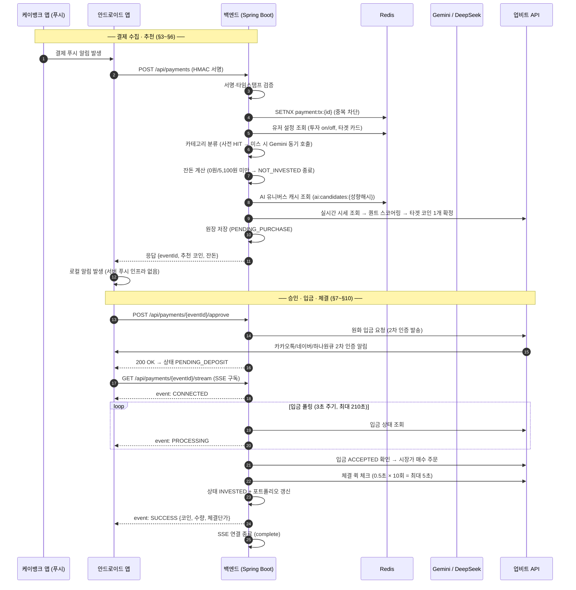
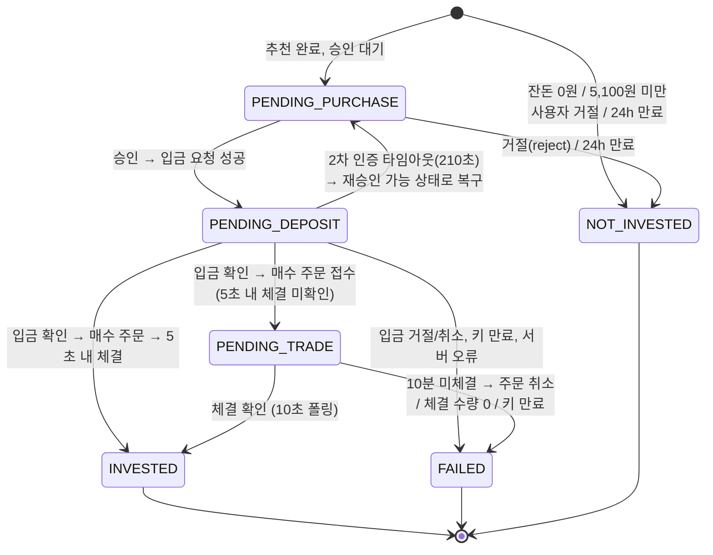

# Tikkle 결제 → 투자 파이프라인 명세서

카드 결제 발생부터 업비트 매수 체결까지, 티끌의 핵심 파이프라인 전체를 다루는 단일 문서입니다.

| 항목 | 내용 |
| --- | --- |
| 문서 버전 | 2.0 |
| 최종 수정일 | 2026-07-18 |
| 작성 기준 | 백엔드 코드(`com.tikkle.payment` / `upbit` / `investment`) 및 `Tikkle_requirements.md`(FEAT-SYS-001~006) 대조 |
| 대체 문서 | 구 `payment_flow.md`(초기 설계서), 구 `auto_trade_flow_final.md`(FE 연동 가이드) — 본 문서로 통합 |

> **독자**: 백엔드 개발자(파이프라인·스케줄러·상태 모델), 프론트엔드/안드로이드 개발자(§3 수집 API, §8 승인 API, §9 SSE 계약).

---

## 1. 설계 원칙

1. **모든 매수는 사용자 승인을 거친다.** 자동/수동 모드 개념은 없다. 결제가 발생하면 서버는 추천 코인을 확정해 `PENDING_PURCHASE`로 적재할 뿐, 실제 돈이 움직이는 것은 사용자가 앱에서 [투자하기]를 누른 이후다.
2. **승인 전에는 업비트를 호출하지 않는다.** 결제 1건의 최초 업비트 API 호출 시점은 `POST /approve`(원화 입금 요청)다.
3. **결제 인입은 3초 예산.** 결제 건마다 무거운 AI를 호출하지 않도록, 코인 추천은 "12시간 주기 AI 유니버스(Stage 1) + 결제 시점 실시간 퀀트 스코어링(Stage 2)"의 2-Stage 구조로 처리한다.
4. **긴 대기는 SSE + 백그라운드 폴링.** 업비트 2차 인증(최대 3분대)을 HTTP 응답으로 기다리면 모바일 타임아웃이 나므로, 승인 API는 즉시 응답하고 결과는 SSE로 푸시한다. 입금/체결 상태는 서버 스케줄러가 폴링한다.
5. **가치 없는 트래픽은 원장 적재 전에 차단한다(Fail-Fast).** 중복·투자 비활성·타 카드 결제는 DB에 남지 않는다.
6. **주문 유실 방지 최우선.** 업비트에 주문이 접수된 뒤에는 어떤 실패가 나도 주문 uuid를 잃지 않도록 예외를 삼키고 비동기 추적으로 전환한다.

---

## 2. 전체 흐름도



---

## 3. 결제 수집 API (안드로이드 → 서버)

- **엔드포인트**: `POST /api/payments` — JWT가 아닌 **HMAC 서명 인증** (Security에서는 permitAll, 인터셉터가 검증)
- **동작 방식**: 안드로이드 앱이 케이뱅크 앱의 결제 푸시 알림을 스크래핑하여 서버로 전송한다. 매수 **제안** 알림("잔돈 N원으로 ○○ 코인에 투자할까요?")은 이 API의 **응답을 받은 앱이 직접 로컬 알림**으로 띄운다. (승인 이후의 **결과** 알림은 서버가 FCM으로 단독 발송한다 — §9.1.)

**요청 본문** (`PaymentScrapingRequest`)

| 필드 | 타입 | 설명 |
| --- | --- | --- |
| `userId` | Long | 사용자 ID |
| `cardCompany` | String | 카드사명 (예: `KBANK`) |
| `cardNumberLast4` | String | 카드 번호 끝 4자리 |
| `merchant` | String | 가맹점명 원문 (예: "스타벅스 강남점") |
| `amount` | Integer | 결제 금액 (양수) |
| `transactionId` | String | 앱이 생성한 고유 트랜잭션 ID (멱등성 키) |

**응답 본문** (`PaymentScrapingResponse`)

| 필드 | 설명 |
| --- | --- |
| `paymentEventId` | 생성된 결제 이벤트 ID (차단 건은 `null`) |
| `actionType` | `PENDING_PURCHASE` / `IGNORE_NO_SPARE_CHANGE` / `IGNORE_MINIMUM_AMOUNT_UNMET` |
| `merchant` | 정제된 가맹점 키워드 |
| `amount` / `spareChange` | 결제 금액 / 계산된 잔돈 |
| `market` / `coinName` | 추천 코인 마켓·이름 (투자 대상 건만) |

---

## 4. 1단계 — 보안 검증 (FEAT-SYS-001)

`RequestBodyCachingFilter`(본문 캐싱) → `PaymentSecurityInterceptor` 순으로 동작한다.

| 검증 | 규칙 | 실패 시 |
| --- | --- | --- |
| 헤더 존재 | `X-Tikkle-Signature`, `X-Tikkle-Timestamp`(epoch 초) 필수 | `PAYMENT-001` (401) |
| 전송 지연 | 서버 시각과 타임스탬프 차이가 **±5분(300초) 이내** | `PAYMENT-002` (401) |
| 서명 무결성 | `HMAC-SHA256(rawBody + timestamp, secretKey)`를 Base64로 비교. 시크릿은 앱(`VITE_PAYMENT_SECRET_KEY`)과 서버(`tikkle.payment.secret-key`)가 공유 | `PAYMENT-001` (401) |
| 필터 구성 | 본문 캐싱 필터 미적용 시 (설정 오류) | `PAYMENT-010` (500) |

---

## 5. 2단계 — Fail-Fast 필터링 (FEAT-SYS-002)

세 검사 모두 **원장(ledger) 적재 이전에** 예외를 던진다. 차단된 트래픽은 DB에 남지 않는다.

| 순서 | 검사 | 방법 | 실패 시 |
| --- | --- | --- | --- |
| 1 | **중복 결제 차단** | Redis `SETNX payment:tx:{transactionId}` (TTL 24h). 선점 실패 = 중복 | `PAYMENT-009` (409) |
| 2 | **투자 비활성** | Redis 유저 설정 캐시(`user:settings:{userId}`)의 `isInvestmentEnabled` 확인 (미스 시 DB 폴백 후 re-warming) | `PAYMENT-011` (409) |
| 3 | **타겟 카드 매칭** | 요청의 카드사+끝4자리가 등록된 타겟 카드와 일치해야 함 | `PAYMENT-008` (409) |

> 2·3번에서 차단되거나 이후 단계에서 예외가 나면 Redis 멱등 키를 삭제해, 일시 오류로 인해 정상 결제가 영구 차단되지 않도록 한다. 동시성 중복이 Redis를 뚫고 들어와도 DB 유니크 제약(transactionId)이 최종 방어한다.

---

## 6. 3단계 — 분류 · 잔돈 계산 · 코인 추천

### 6.1 2-Tier 카테고리 분류 (FEAT-SYS-003)

1. **1차 (사전 HIT)**: `PAYMENT_CATEGORY_MAPPING` 테이블에서 가맹점명 부분 일치 검색 → 히트 시 즉시 확정
2. **2차 (AI 폴백)**: 미스 시 **동기 Gemini 호출**(gemini-2.5-flash)로 핵심 키워드 추출 + 7개 카테고리(CAFE/MART/FOOD/SHOPPING/TRAFFIC/CULTURE/ETC) 중 분류. 결과는 사전에 저장되어 **전역적으로 학습 누적**된다(다음부터는 1차에서 히트).
3. **AI 장애 폴백**: 응답 5초 초과·오류·데이터 누락 시 `ETC` 카테고리로 폴백하고 파이프라인은 중단 없이 진행한다.

### 6.2 잔돈 계산 (`SpareChangeCalculator`)

해당 카테고리에 설정된 유저의 잔돈 규칙(`RuleType`)을 적용한다. (규칙 미설정 시 `USER-005`)

| 규칙 | 계산식 | 예 (결제 13,500원) |
| --- | --- | --- |
| `ROUND_UP_10000` ~ `ROUND_UP_50000` | `(N - amount % N) % N` — N원 단위 올림 차액 | 1만 올림 → 6,500원 |
| `PERCENT_10` ~ `PERCENT_30` | `amount × N%` (내림) | 20% → 2,700원 |

**조기 차단 (원장에는 `NOT_INVESTED`로 기록됨)**

| 조건 | actionType | 비고 |
| --- | --- | --- |
| 잔돈 = 0원 | `IGNORE_NO_SPARE_CHANGE` | 올림 규칙에서 정확히 단위 배수 결제 시 발생 |
| 잔돈 < **5,100원** | `IGNORE_MINIMUM_AMOUNT_UNMET` | 업비트 최소 주문 금액(5,000원) + 수수료 여유분 |

### 6.3 타겟 코인 추천 — 2-Stage 퀀트 엔진 (FEAT-SYS-006)

**Stage 1 — AI 유니버스 (12시간 주기, 사전 생성)**

- `AiPortfolioScheduler`가 매일 **02:00 / 14:00 KST**에 실행된다.
- 시황 데이터(거래소 API, CoinGecko, Fear & Greed 등)를 수집한 뒤 LLM(**DeepSeek**, OpenAI 호환 API)을 호출해, **9가지 성향 조합(RiskTolerance × TrendSensitivity)별 추천 코인 15개** 유니버스를 생성한다.
- 결과는 Redis `ai:candidates:{RISK:TREND}` (TTL 12h)와 DB `AI_RECOMMENDATION_HISTORY`에 저장된다.

**Stage 2 — 실시간 스코어링 (결제 시점, `PortfolioScoringEngine`)**

1. 유저 성향 해시로 Redis에서 후보군 조회 (미스 시 DB 최신 이력 폴백 + Redis 재적재)
2. `COIN_METADATA`에 존재하는 유효 마켓만 필터링 (메타데이터는 `CoinSyncScheduler`가 매일 04:00 KST 동기화)
3. 업비트 실시간 시세 일괄 조회 + 유저의 **최근 매수 이력 10건** 조회
4. AHP 가중치(합계 1.0, 성향에 따라 동적 배분) 기반 점수 산출:
   - **AI 순위 점수** (Stage 1 순서), **테마 적합도** (관심 테마 일치 여부 0/100), **트렌드 점수** (등락률 시그모이드), **리스크 점수** (위험 감수 성향별 등락률 해석), **분산 성향** (최근 매수 이력과의 중복 회피)
   - **밈 코인**: `MemeAcceptance = NONE`이면 밈 코인은 **영구 탈락**, 수용도가 높으면 소폭 가점(최대 3점)
5. 최고 점수 코인 1개를 최종 확정

**폴백**: 프로필 없음 · 캐시/파싱 실패 · 유효 후보 없음 등 어떤 단계에서 실패하든 **`KRW-BTC`(비트코인)로 폴백**하여 파이프라인은 항상 결과를 낸다.

### 6.4 승인 대기 적재 (FEAT-SYS-004)

- 추천 코인과 함께 원장을 **`PENDING_PURCHASE`** 상태로 저장하고, 앱에 `paymentEventId` + 추천 정보를 응답한다.
- 앱은 이 응답으로 로컬 알림을 띄운다. 사용자가 알림(또는 결제 내역의 '대기 중' 건)을 탭하면 **잔돈 투자 확인 화면**(화면설명서 PAY-04)으로 진입한다.
- **24시간 내 미승인** 시 `PendingOrderExpirationScheduler`(매시 정각)가 `NOT_INVESTED`로 만료 처리한다.

---

## 7. 상태 모델 (PaymentStatus)



### 7.1 상태 정의

| 상태 | 의미 |
| --- | --- |
| `NOT_INVESTED` | 투자 대상 제외 (잔돈 미달, 사용자 거절, 24시간 만료) |
| `PENDING_PURCHASE` | 코인 추천 완료, 사용자 매수 승인 대기 중 |
| `PENDING_DEPOSIT` | 승인 완료, 업비트 원화 입금(2차 인증) 대기 중 |
| `PENDING_TRADE` | 매수 주문 접수 완료, 체결 대기 중 (백그라운드 추적) |
| `INVESTED` | 매수 체결 완료 — 최종 성공 |
| `FAILED` | 입금/매수 실패 (사유는 `reason` 컬럼에 기록) |

### 7.2 프론트엔드 노출 상태 매핑 (`PaymentViewStatus`)

결제 내역 API는 내부 6개 상태를 4개로 축약해 내려준다.

| 내부 상태 | FE 노출 | `expiredAt` (해당 단계 마감) | 추가 필드 |
| --- | --- | --- | --- |
| `PENDING_PURCHASE` | `PENDING` | 생성 시각 + **24시간** | 추천 코인 정보 |
| `PENDING_DEPOSIT` | `IN_PROGRESS` | 입금 요청 시각 + **210초** | — |
| `PENDING_TRADE` | `IN_PROGRESS` | 주문 접수 시각 + **10분** | — |
| `INVESTED` | `INVESTED` | — | 체결 수량·단가 |
| `NOT_INVESTED` / `FAILED` | `CANCELED` | — | — |

> **`PENDING`과 `IN_PROGRESS`를 반드시 구분할 것.** `PENDING`만이 승인/거절 가능한 상태다.
> 이전에는 승인 이후 단계(`PENDING_DEPOSIT`/`PENDING_TRADE`)도 `PENDING`으로 내려가, 앱이 이미 승인된 건에
> 승인 버튼을 계속 노출했고 사용자가 누르면 `PAYMENT-006`이 발생했다. `IN_PROGRESS`에서는 승인/거절 버튼을
> 숨기고 진행 상태만 표시한다.

---

## 8. 승인 / 거절 API (FEAT-SYS-005)

### 8.1 `POST /api/payments/{eventId}/approve` — 매수 승인

- 본인 소유 + `PENDING_PURCHASE` 상태의 건만 승인 가능 (행 잠금으로 동시 승인 방지)
- 연동 계좌와 2차 인증 수단이 등록되어 있어야 한다
- 성공 시: 업비트에 **원화 입금 요청**(잔돈 금액, 등록된 2차 인증 수단으로 인증 발송) → `PENDING_DEPOSIT` 전이 + `deposit_uuid` 저장 → `200 OK` 즉시 응답
- **입금 요청 실패 시 `FAILED`로 마킹하지 않고 `PENDING_PURCHASE`를 유지한다.** 실제 출금은 2차 인증 완료 후에 일어나므로 요청 실패 시점에 되돌릴 것이 없고, 실패 확정 시 일시 오류만으로 투자 기회가 사라지기 때문이다(재시도 가능).

| 에러 | 코드 | 상황 |
| --- | --- | --- |
| 결제 건 없음/타인 소유 | `PAYMENT-004` (404) | 존재하지 않거나 남의 건 (소유 여부 노출 방지를 위해 동일 처리) |
| 상태 부적합 | `PAYMENT-006` (400) | `PENDING_PURCHASE`가 아닌 건 승인/거절 시도 |
| 연동 계좌 없음 | `USER-003` (404) | 업비트 키 미등록 |
| 2차 인증 수단 없음 | `USER-004` (400) | twoFactorProvider 미설정 |
| 업비트 키 만료 | `UPBIT-010` (401) | 응답 code `UPBIT_INVALID_KEY` → **FE는 업비트 재연동 화면으로 유도** |
| 입금 요청 실패 | `PAYMENT-007` (500) | 기타 업비트 통신 오류 (상태는 PENDING_PURCHASE 유지) |

### 8.2 `POST /api/payments/{eventId}/reject` — 매수 거절

- 본인 소유 + `PENDING_PURCHASE` 건만 가능 → `NOT_INVESTED` 전이 (사유: "사용자에 의한 매수 거절")

### 8.3 `GET /api/payments/{eventId}/stream` — SSE 구독

- 헤더: `Accept: text/event-stream`, `Authorization: Bearer {JWT}`
- 구독 전 소유권 검증(타인 건은 `PAYMENT-004`) 후 emitter 등록. **연결 유지 시간 210초**(업비트 2차 인증 3분 + 여유)
- approve가 `200 OK`로 떨어지는 **즉시** 구독할 것 (2차 인증 완료가 매우 빠를 수 있음)
- **재구독 가능하며, 재구독이 정상 경로다.** 2차 인증은 카카오·네이버 등 외부 앱에서 완료하므로 이 구간에서 앱 이탈은 필연이고, 그때 SSE는 반드시 끊긴다. 앱 복귀 시 `GET /api/payments/in-progress`로 진행 중인 `eventId`를 얻어 다시 구독하면 된다.
- 서버는 구독 직후 `CONNECTED`에 이어 **현재 상태 스냅샷을 1회 발송**한다(§9). 끊겨 있던 동안 확정된 결과가 그대로 전달되며, 이미 종료된 건이면 최종 이벤트를 보내고 연결을 즉시 닫으므로 210초를 헛되이 기다리지 않는다.
- 같은 `eventId`로 다시 구독하면 서버가 이전 커넥션을 `complete()` 하고 교체한다(좀비 커넥션 누적 방지).

### 8.4 `GET /api/payments/in-progress` — 진행 중인 건 조회

- 승인 이후 아직 끝나지 않은 건(`PENDING_DEPOSIT`, `PENDING_TRADE`)을 최신순 배열로 반환. 없으면 빈 배열
- 앱 재진입(onResume) 시 호출해 화면을 복구하고, 반환된 `eventId`로 §8.3을 재구독하는 것이 표준 복구 절차다
- 응답 필드: `eventId`, `status`(내부 상태 그대로), `merchant`, `amount`, `spareChange`, `targetCoinMarket`, `targetCoinName`, `expiresAt`, `createdAt`
- `expiresAt`은 **현재 단계**의 마감 시각이다 (`PENDING_DEPOSIT` → 입금 요청 + 210초, `PENDING_TRADE` → 주문 접수 + 10분). 남은 시간 표시에 그대로 쓸 수 있다
- `PENDING_PURCHASE`(승인 대기)는 포함하지 않는다. 그건 진행 중인 건이 아니라 대기 목록이며 결제 피드가 담당한다

---

## 9. SSE 이벤트 계약 (FE 연동 가이드)

서버가 `event:` 이름과 `data:`(JSON 또는 문자열)를 내려보낸다. **최종 이벤트 수신 시 서버가 연결을 스스로 종료(complete)** 하므로, FE는 최종 이벤트를 받은 직후 반드시 `close()`(또는 abort)를 호출해 브라우저의 자동 재연결을 차단해야 한다.

| 이벤트 | 구분 | 상황 | FE 처리 (화면설명서 연계) |
| --- | --- | --- | --- |
| `CONNECTED` | 진행 | 연결 성공 직후 1회 (타임아웃 방지 더미) | 로딩 유지 |
| `PROCESSING` | 진행 | 3초마다 — 2차 인증 대기 폴링 중 | "2차 인증을 완료해 주세요" 화면 유지 (PAY-05) |
| `SUCCESS` | **최종** | 체결 완료 (즉시 체결 또는 지연 체결) | 매수 완료 화면 (PAY-06) |
| `PENDING_TRADE` | **최종** | 주문 접수됐으나 5초 내 미체결 → 백그라운드 추적 전환 | "주문 접수 완료" 화면. 사용자를 붙잡지 말 것 — 체결 시 결제 내역에 반영됨 |
| `DEPOSIT_FAILED` | **최종** | 입금 거절/취소 (케이뱅크 잔액 부족 등). **출금된 원화 없음** | 입금 실패 화면 |
| `TRADE_FAILED` | **최종** | 매수 주문 접수 실패. **원화는 업비트 계좌에 잔류** — 반드시 고지 | 매수 실패 화면 + 원화 보관 안내 |
| `TIMEOUT` | **최종** | 210초 내 2차 인증 미완료. **결제 건은 `PENDING_PURCHASE`로 복구되어 재승인 가능** | 시간 초과 안내 (§11.1 참고) |
| `UPBIT_INVALID_KEY` | **최종** | 진행 중 키 만료/권한 박탈 감지 → `FAILED` | 재연동 유도 → 업비트 계정 관리 화면 |
| `FAILED` | **최종** | 그 외 예기치 못한 서버 오류 → `FAILED` | 일반 실패 안내 |
| `CLOSED` | **최종** | 재구독했으나 이미 `NOT_INVESTED`로 종료된 건 (거절·24시간 만료) | 진행 화면을 닫고 결제 내역으로 이동 |

**구독 직후 상태 스냅샷**

재구독이 정상 경로이므로(§8.3), 서버는 `CONNECTED` 직후 결제 건의 현재 상태를 아래 규칙으로 **1회 더** 발송한다. 이벤트 이름과 data 형태는 위 표와 완전히 동일하므로 FE는 별도 분기 없이 기존 핸들러로 처리하면 된다.

| 구독 시점의 내부 상태 | 발송 이벤트 | 연결 |
| --- | --- | --- |
| `PENDING_DEPOSIT` | `PROCESSING` | 유지 (이후 폴링이 계속 발송) |
| `PENDING_PURCHASE` | `TIMEOUT` | 즉시 종료 — 승인 건이 없거나 210초 타임아웃으로 복구된 상태이므로 재승인 안내 |
| `PENDING_TRADE` | `PENDING_TRADE` | 즉시 종료 |
| `INVESTED` | `SUCCESS` | 즉시 종료 |
| `FAILED` | `FAILED` | 즉시 종료 |
| `NOT_INVESTED` | `CLOSED` | 즉시 종료 |

**데이터 예시**

```json
// SUCCESS
{ "status": "SUCCESS", "message": "시장가 매수 체결 완료",
  "targetCoinName": "이더리움", "investedVolume": 0.00190715, "investedPrice": 2725000.0 }

// PENDING_TRADE
{ "status": "PENDING_TRADE",
  "message": "주문 접수됨. 5초 내 체결이 확인되지 않아 비동기 추적으로 전환. 스트림 종료되며 최종 결과는 결제 내역 재조회로 확인 필요" }

// TRADE_FAILED
{ "status": "TRADE_FAILED", "message": "업비트 매수 주문 접수 실패. 입금된 원화는 업비트 계좌에 잔류" }
```

> `CONNECTED` / `PROCESSING` / `TIMEOUT`의 data는 JSON이 아닌 **평문 문자열**이므로 무조건 `JSON.parse` 하지 말 것. 나머지 이벤트는 위 예시와 같은 JSON 객체다. (현재 FE는 `CONNECTED`/`PROCESSING`을 파싱 없이 무시하도록 구현되어 있다.)

### 9.1 FCM 결과 알림 (SSE 보완)

SSE는 사용자가 승인 화면에서 대기하는 **최대 3분 구간**만 커버한다. 지연 체결·10분 타임아웃·24시간 만료처럼 **SSE가 이미 끊긴 뒤 확정되는 결과**, 그리고 앱을 떠난 상태에서 도착하는 실패는 서버가 **FCM**으로 단독 발송한다. SSE와 FCM은 경쟁이 아니라 **역할 분담**이다.

**승인 이후 결제 건이 끝나는 경로는 아래가 전부이고, 모든 경로가 FCM 대상이다.** 어느 하나라도 빠지면 사용자는 결과를 통보받지 못한 채 방치된다.

| `NotificationType` | 발송 지점(코드) | 대응 SSE 이벤트 | SSE 억제 |
| --- | --- | --- | --- |
| `TRADE_SUCCESS` | `UpbitDepositPollingProcessor.handleTradeResult` (즉시 체결) | `SUCCESS` | **적용** |
| `TRADE_FAILED` | `UpbitDepositPollingProcessor.handleTradeFailed` | `TRADE_FAILED` | **적용** |
| `TRADE_FAILED` | `UpbitDepositPollingProcessor.handleGeneralError` | `FAILED` | **적용** |
| `DEPOSIT_FAILED` | `UpbitDepositPollingProcessor.handleDepositFailed` | `DEPOSIT_FAILED` | **적용** |
| `DEPOSIT_TIMEOUT` | `UpbitDepositPollingProcessor.handleTimeout` | `TIMEOUT` | **적용** |
| `UPBIT_INVALID_KEY` | `UpbitDepositPollingProcessor.handleInvalidKeyError` | `UPBIT_INVALID_KEY` | **적용** |
| `TRADE_SUCCESS` | `UpbitTradePollingProcessor.handleSettledOrder` (지연 체결) | `SUCCESS` | 미적용(지연 구간, 사실상 항상 끊김) |
| `TRADE_FAILED` | `UpbitTradePollingProcessor.handleSettledOrder` (체결 수량 0 / targetCoin 누락) | `TRADE_FAILED` | 미적용 |
| `TRADE_TIMEOUT` | `UpbitTradePollingProcessor.handleTimeout` | `TRADE_FAILED` | 미적용 |
| `UPBIT_INVALID_KEY` | `UpbitTradePollingProcessor.handleInvalidKeyError` | `UPBIT_INVALID_KEY` | 미적용 |
| `ORDER_EXPIRED` | `PendingOrderExpirationScheduler.expireOldPendingOrders` | (없음) | 미적용 |

- **억제 규칙**: SSE **발송에 실제로 성공했으면** 동일 이벤트의 FCM은 보내지 않는다. `SseConnectionManager.send()`의 **반환값**으로 판정한다.
- **커넥션 존재 여부로 판정하면 안 된다.** 서버는 다음 쓰기를 시도할 때 비로소 클라이언트의 끊김을 알게 되므로, 앱을 떠난 직후에는 emitter가 잠시 맵에 남아 "연결됨"으로 보인다. 그 상태에서 발송이 `IOException`으로 실패해도 FCM이 억제되어 결과가 유실된다. **하필 입금을 확인한 폴링 주기가 곧 최종 결과를 보내는 주기**여서 가장 중요한 이벤트가 이 창에 걸린다. 이 때문에 `isConnected()`는 제거했다.
- **입금 210초 타임아웃**(`UpbitDepositPollingProcessor.handleTimeout`)도 FCM 대상이다. 2차 인증은 카카오·네이버 앱에서 완료하므로 이 구간의 사용자는 대부분 티끌 앱을 떠나 있고, SSE는 끊겨 있다. "사용자가 화면 앞에 있으므로 SSE만으로 충분하다"는 초기 가정은 성립하지 않아 인증을 놓친 사용자가 아무 통보도 받지 못했다. `PENDING_PURCHASE`로 복구되어 재승인이 가능하므로 알림 본문은 재승인을 안내한다.
- **남은 한계(알려진 이슈)**: `send()` 성공은 소켓에 써 넣는 데 성공했다는 뜻이지 앱이 실제로 화면에 표시했다는 보장은 아니다. 확실한 해법은 서버가 항상 FCM을 보내고 FE가 `eventId` 기준으로 중복을 제거하는 것이지만, 현재는 "FE에 중복 처리 부담을 주지 않는다"는 방침을 유지한다.
- **발송이 생략되는 두 경우는 INFO로 로깅한다** — `tikkle.fcm.enabled=false`(빈 없음), 디바이스 토큰 0건. 생략되면 사용자에게 아무 흔적도 남지 않으므로, 로그가 없으면 "코드 누락인지 환경 문제인지" 구분할 수 없다.
- **발송 3원칙**: ① 트랜잭션 커밋 이후 발송(`afterCommit`, 롤백 시 허위 알림 방지) ② 발송 실패는 상위로 전파하지 않고 로깅만(결제 파이프라인 비차단) ③ FCM이 무효 판정한 토큰(`UNREGISTERED`/`INVALID_ARGUMENT`)은 즉시 정리.
- **비활성 스위치**: `tikkle.fcm.enabled=false`(로컬 기본값)이면 `FirebaseMessaging` 빈이 없어 발송은 no-op이 된다. 페이로드·딥링크 상세 계약은 `Tikkle_notification_spec.md` §7 참조.

---

## 10. 승인 이후 백그라운드 파이프라인

### 10.1 입금 폴링 — `UpbitDepositPollingScheduler` (3초 주기)

`PENDING_DEPOSIT` 상태의 모든 건에 대해 `deposit_uuid`로 업비트 입금 상태를 조회한다.

| 입금 상태 | 처리 |
| --- | --- |
| 그 외 (대기 중) | SSE `PROCESSING` 발송 후 다음 주기 대기 |
| `ACCEPTED` | 즉시 시장가 매수 실행 (§10.2) |
| `REJECTED` / `CANCELED` | `FAILED` 마킹 + SSE `DEPOSIT_FAILED` + FCM `DEPOSIT_FAILED` (출금된 원화 없음) |
| **210초 경과** | **`PENDING_PURCHASE`로 복구**(재승인 가능) + SSE `TIMEOUT` + FCM `DEPOSIT_TIMEOUT` |
| 업비트 401/403 | `FAILED` + SSE `UPBIT_INVALID_KEY` + FCM `UPBIT_INVALID_KEY` |
| 그 외 예기치 못한 오류 | `FAILED` + SSE `FAILED` + FCM `TRADE_FAILED` |

### 10.2 시장가 매수 — `UpbitTradeService`

1. **수수료 역산**: 주문 금액 = 잔돈 ÷ 1.0005 (내림). 수수료(0.05%) 포함 총 출금액이 잔돈을 초과하지 않도록 보정
2. **멱등 주문**: 주문 identifier로 `tikkle-{eventId}` 고정값을 사용. 요청 실패 시 identifier로 재조회해 실제 접수 여부를 확인한 뒤에만 실패로 확정 → 동일 결제 건이 업비트에 중복 주문되지 않음
3. **퀵 체결 확인**: 0.5초 간격 × 최대 10회(약 5초) 주문 상태 폴링
   - 시장가 매수는 부분 체결 후 잔량이 `cancel` 되는 것이 정상 흐름이므로 **`done`과 `cancel` 모두 체결 확인 대상**이며, 개별 체결 내역(trades)의 수량·금액을 합산해 평균 단가를 계산한다
   - 체결 확인 → `INVESTED` + `PORTFOLIOS` 갱신 + SSE `SUCCESS` + FCM `TRADE_SUCCESS`(연결이 끊겨 있을 때) + 연결 종료
   - 5초 내 미확인 → `PENDING_TRADE` 전이 + SSE `PENDING_TRADE` + 연결 종료 (이후는 §10.3)
4. **주문 접수 후에는 예외를 밖으로 던지지 않는다.** uuid를 잃으면 사용자의 코인이 유실되므로, 체결 확인 중 오류가 나도 `PENDING_TRADE`로 전환해 스케줄러가 이어서 추적한다.

### 10.3 지연 체결 추적 — `UpbitTradePollingScheduler` (10초 주기)

`PENDING_TRADE` 상태의 건을 계속 추적한다. FE 연결은 이미 끊긴 상태일 수 있으며, 결과는 원장에 반영되고 앱은 결제 내역 재조회로 확인한다.

| 상황 | 처리 |
| --- | --- |
| `done`/`cancel` + 체결 수량 > 0 | 부분 체결 포함 합산 → `INVESTED` + 포트폴리오 갱신 + SSE `SUCCESS` + FCM `TRADE_SUCCESS` |
| `done`/`cancel` + 체결 수량 0 | `FAILED` + SSE `TRADE_FAILED` + FCM `TRADE_FAILED` (원화는 업비트 잔류) |
| `targetCoin` 정보 누락 | `FAILED` + SSE `TRADE_FAILED` + FCM `TRADE_FAILED` (원화는 업비트 잔류) |
| **10분 경과** | 주문 강제 취소 후 `FAILED` + SSE `TRADE_FAILED` + FCM `TRADE_TIMEOUT` — 시장 변동성에 물리는 것 방지. **취소된 원화는 환불되지 않고 업비트 계좌에 보관** |
| 업비트 401/403 | `FAILED` + SSE `UPBIT_INVALID_KEY` + FCM `UPBIT_INVALID_KEY` |

> **원화가 업비트에 남는 실패는 반드시 통보한다.** 이전에는 체결 수량 0 / `targetCoin` 누락 두 경로가 SSE도 FCM도 없이 조용히 `FAILED`로만 끝나, 사용자가 자기 원화가 업비트에 있다는 사실을 알 방법이 없었다.

### 10.4 스케줄러 요약

| 스케줄러 | 주기 | 역할 |
| --- | --- | --- |
| `UpbitDepositPollingScheduler` | 3초 | `PENDING_DEPOSIT` 입금 확인 → 매수 실행 |
| `UpbitTradePollingScheduler` | 10초 | `PENDING_TRADE` 체결 추적 (10분 타임아웃) |
| `PendingOrderExpirationScheduler` | 매시 정각 | 24시간 경과한 `PENDING_PURCHASE` → `NOT_INVESTED` |
| `AiPortfolioScheduler` | 02:00 / 14:00 KST | 성향 조합별 AI 추천 유니버스 생성 (DeepSeek) |
| `CoinSyncScheduler` | 04:00 KST | 업비트 코인 메타데이터 동기화 |

> 분산 락이 없으므로 **단일 인스턴스 구동을 가정**한다. 다중 인스턴스 배포 시 스케줄러 중복 실행 문제가 발생한다.

---

## 11. 실패 케이스 총정리 — "내 돈은 어디에 있는가"

| 실패 지점 | 상태 | 원화 위치 | 사용자 안내 |
| --- | --- | --- | --- |
| 승인 시 입금 요청 실패 | `PENDING_PURCHASE` 유지 | 케이뱅크 (이동 없음) | 재시도 유도 |
| 2차 인증 210초 초과 | `PENDING_PURCHASE` 복구 | 케이뱅크 (이동 없음) | 재승인 가능 |
| 입금 거절/취소 (`DEPOSIT_FAILED`) | `FAILED` | 케이뱅크 (이동 없음) | 계좌 잔액 확인 안내 |
| 매수 주문 접수 실패 (`TRADE_FAILED`) | `FAILED` | **업비트 계좌 잔류** | 업비트에서 직접 매수/출금 안내 **(필수 고지)** |
| 10분 미체결 → 주문 취소 | `FAILED` | **업비트 계좌 잔류** | 결제 내역에서 취소 확인 |
| 체결 수량 0 | `FAILED` | **업비트 계좌 잔류** | 〃 |
| 진행 중 키 만료 (`UPBIT_INVALID_KEY`) | `FAILED` | 단계에 따라 상이 | 업비트 재연동 유도 |
| 24시간 미승인 | `NOT_INVESTED` | 케이뱅크 (이동 없음) | 만료 표시 |

### 11.1 알려진 이슈 / 개선 후보

- **TIMEOUT 처리 FE-BE 불일치**: 백엔드는 2차 인증 타임아웃 시 건을 `PENDING_PURCHASE`로 복구해 재승인이 가능하지만, 현재 FE(`PaymentReviewView`)는 `TIMEOUT` 수신 시 해당 건을 로컬에서 '취소'로 표시한다. 목록을 새로고침하면 다시 '대기 중'으로 보이므로, FE가 TIMEOUT을 "재시도 가능" UX로 바꾸는 것이 정합적이다.
- **FE 재구독 미구현 (BE 준비 완료)**: 2차 인증 구간의 앱 이탈은 정상 경로이므로 FE는 앱 재진입(onResume) 시 ① `GET /api/payments/in-progress` 호출 → ② 진행 중인 건이 있으면 해당 화면 복구 → ③ 그 `eventId`로 `/stream` 재구독, 의 순서를 구현해야 한다. 서버는 구독 직후 상태 스냅샷을 보내므로 끊겨 있던 동안의 결과가 유실되지 않는다.
- **승인 버튼 노출 조건**: 결제 피드에서 승인/거절 버튼은 `status == PENDING`일 때만 노출할 것. `IN_PROGRESS`는 이미 승인된 건이라 요청하면 `PAYMENT-006`이 떨어진다.
- **업비트 키 사전 점검**: 앱 부팅 시 `GET /api/users/me`의 `hasUpbitKey: false`를 감지하면 재연동을 선제 안내할 수 있다 (온보딩 화면의 키 만료 재연동 모드로 연결됨).

---

## 12. 관련 문서

- `Tikkle_requirements.md` — §5 FEAT-SYS-001~006 엔진 명세 (본 문서의 상위 요구사항)
- `Tikkle_ERD.md` — `PAYMENT_EVENTS`, `AI_RECOMMENDATION_HISTORY`, `PORTFOLIOS` 등 전체 스키마
- `화면설명서/화면설명서.md` — §7 결제 내역 & 잔돈 투자 (PAY-01~07) 화면 명세
