# Tikkle(티끌) 화면 설명서

| 항목 | 내용 |
| --- | --- |
| 문서 버전 | 2.0 |
| 최종 수정일 | 2026-07-18 |
| 작성 기준 | 앱 버전 1.0.0 · 실기기 스크린샷 26장(`1.jpg`~`26.jpg`) · 프론트엔드 코드(`Tikkle-app/src`) 대조 |

> 스크린샷이 없는 화면(설정 하위 일부 화면, 각종 바텀시트, 투자 결과 분기 화면)도 실제 기능으로 존재하며, 코드 기준으로 함께 기술했습니다.

---

## 1. 서비스 개요

**Tikkle(티끌)** 은 "잔돈으로 시작하는 나만의 코인 투자" 서비스입니다.

- 사용자의 **케이뱅크 카드** 결제가 발생하면(케이뱅크 앱 푸시 알림 수집 방식), 설정된 잔돈 규칙(올림/비율)에 따라 잔돈을 계산합니다.
- 계산된 잔돈은 케이뱅크 계좌에서 출금되어 **업비트(Upbit)** 로 입금되고, AI가 사용자의 투자 성향에 맞춰 추천한 코인을 시장가로 매수합니다.
- 매매 방식은 **자동 투자**(전 과정 자동 실행)와 **수동 승인**(대기 중 건을 사용자가 직접 승인/취소) 두 가지 흐름을 지원합니다.
- 잔돈이 **5,100원 미만**이면 투자가 진행되지 않습니다(업비트 최소 주문 금액 대응 정책).

---

## 2. 전체 화면 맵

```
로그인(AUTH-01) ─ 회원가입 3단계(AUTH-02~04)
      │
      ▼
온보딩 8단계(ONB-01~08)  ※ 최초 1회, 미완료 시 재진입
      │
      ▼
┌─────────────── 하단 탭 바 ───────────────┐
│  홈        결제내역       인사이트        설정  │
│ HOME-01   PAY-01~03     INS-01~04     SET-01~09 │
└──────────────────────────────────────┘
                │
                └─ 잔돈 투자 승인 플로우 (PAY-04~06) ※ 대기 건 탭 또는 푸시 딥링크로 진입
```

| 화면 ID | 화면명 | 라우트 | 스크린샷 |
| --- | --- | --- | --- |
| AUTH-01 | 로그인 | `/login` | 1 |
| AUTH-02~04 | 회원가입 (전화번호 → 인증번호 → 정보 입력) | `/signup` | 2, 3, 4 |
| ONB-01 | 온보딩 1/8 — 케이뱅크 카드 등록 | `/onboarding` | 5 |
| ONB-02 | 온보딩 2/8 — 업비트 계정 연결 | `/onboarding` | 6, 7 |
| ONB-03~07 | 온보딩 3~7/8 — 투자 성향 설문 Q1~Q5 | `/onboarding` | 8~12 |
| ONB-08 | 온보딩 8/8 — 잔돈 규칙 설정 | `/onboarding` | 13 |
| HOME-01 | 홈 — 내 보유자산 | `/` | 14 ※구버전 |
| PAY-01 | 결제 내역 | `/payments` | 15, 16 |
| PAY-02 | [시트] 조회 기간(월) 선택 | `/payments` 내 모달 | 없음 |
| PAY-03 | [시트] 결제 카테고리 변경 | `/payments` 내 모달 | 없음 |
| PAY-04 | 잔돈 투자 확인 (수동 승인) | `/payments/review` | 17 |
| PAY-05 | 2차 인증 대기 | `/payments/review` 내 상태 | 18 |
| PAY-06 | 매수 완료 | `/payments/review` 내 상태 | 19 |
| PAY-07 | 투자 결과 분기 (접수/실패/만료 등 5종) | `/payments/review` 내 상태 | 없음 |
| INS-01 | 인사이트 — 오늘의 마켓 토픽 | `/insights` | 20 |
| INS-02 | 인사이트 — 초보자 가이드 | `/insights` | 21 |
| INS-03 | [시트] 초보자 글 상세 | `/insights` 내 모달 | 없음 |
| INS-04 | 투자 용어집 | `/insights/glossary` | 22 |
| SET-01 | 설정 메인 | `/settings` | 23, 24 |
| SET-02 | 자동 투자 설정 | `/settings/investment` | 25 |
| SET-03 | 잔돈 규칙 설정 (카테고리별) | `/settings/category-rules` | 26 |
| SET-04 | [시트] 카테고리 잔돈 규칙 편집 | `/settings/category-rules` 내 모달 | 없음 |
| SET-05 | 투자 성향 및 관심 테마 | `/settings/investment-profile` | 없음 |
| SET-06 | 케이뱅크 카드 관리 | `/settings/kbank-card` | 없음 |
| SET-07 | 업비트 계정 관리 | `/settings/api-key` | 없음 |
| SET-08 | [시트] 개인정보 처리방침 / 이용약관 | `/settings` 내 모달 | 없음 |
| SET-09 | [시트] 서비스 탈퇴 확인 | `/settings` 내 모달 | 없음 |

### 접근 제어 (라우팅 가드)

| 구분 | 조건 | 동작 |
| --- | --- | --- |
| 비로그인 | 보호 라우트 접근 | `/login` 으로 리다이렉트 |
| 로그인 + 온보딩 미완료 | 메인 라우트 접근 | `/onboarding` 으로 리다이렉트 |
| 로그인 상태 | `/login`, `/signup` 접근 | 홈(또는 온보딩)으로 리다이렉트 |
| 앱 실행 시 | 저장된 토큰 존재 | 프로필 조회 성공 시 자동 로그인 → 홈/온보딩 분기 |

---

## 3. 공통 UI 및 공통 정책

### 3.1 하단 탭 바 (Bottom Navigation)

- 메인 4개 화면(홈 / 결제내역 / 인사이트 / 설정)에 항상 고정 노출. 활성 탭은 브랜드 컬러(파란색)로 표시.
- **결제내역 탭 빨간 점 뱃지**: 승인 대기 중(PENDING)인 결제 건이 1건 이상이면 아이콘 우상단에 빨간 점을 표시. 어느 탭에서든 대시보드 데이터를 로드해 즉시 반영된다.

### 3.2 색상 규칙 (손익 표기)

- **수익/상승 = 빨간색(+)**, **손실/하락 = 파란색(−)** — 국내 금융 UI 관례를 따른다.
- 브랜드 컬러: `#0051ff` (파란색). 주요 CTA 버튼, 활성 상태, 강조 텍스트에 사용.

### 3.3 바텀시트 공통 동작

모든 바텀시트(모달)는 다음 세 가지 방법으로 닫힌다.

1. 우측 상단 `X` 버튼 탭
2. 시트 바깥 딤(dim) 영역 탭
3. 안드로이드 뒤로가기 버튼 (시트만 닫히고 화면은 유지)

### 3.4 로딩 / 빈 상태 / 에러 패턴

- **로딩**: 첫 데이터 도착 전에는 스켈레톤 UI(홈 자산 카드, 결제내역) 또는 스피너를 노출. 버튼 동작 중에는 버튼 내부에 스피너 + "저장 중...", "검증 중..." 등의 라벨로 전환되고 중복 탭이 방지된다.
- **빈 상태**: 데이터가 없으면 안내 문구를 노출한다. (예: "이번 달 소비 내역이 없어요.", "아직 보유한 코인이 없어요.", "등록된 글이 없습니다")
- **에러**: 화면 하단 또는 해당 영역에 빨간색 에러 문구를 노출하고, 사용자가 재시도할 수 있는 상태를 유지한다.

---

## 4. 인증 (AUTH)

### AUTH-01. 로그인

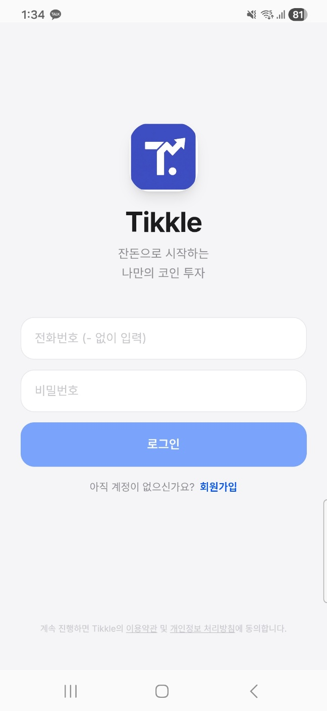

- **라우트**: `/login` (비로그인 전용)
- **개요**: 앱 진입 화면. 전화번호 + 비밀번호 방식의 자체 로그인. 저장된 토큰이 유효하면 이 화면을 거치지 않고 자동 로그인된다.

**UI 구성 및 동작**

1. **브랜드 영역**: Tikkle 로고, 타이틀, 슬로건("잔돈으로 시작하는 나만의 코인 투자")
2. **전화번호 입력**: `-` 없이 숫자만 입력 (숫자 키패드)
3. **비밀번호 입력**: 마스킹 처리, Enter 키로도 로그인 제출 가능
4. **[로그인] 버튼**: 두 필드가 모두 입력되어야 활성화. 처리 중에는 "로그인 중..." + 스피너 표시
5. **회원가입 링크**: "아직 계정이 없으신가요? **회원가입**" → AUTH-02로 이동
6. **약관 고지**: "계속 진행하면 Tikkle의 이용약관 및 개인정보 처리방침에 동의합니다."

**에러 메시지**

| 서버 에러 코드 | 노출 문구 |
| --- | --- |
| `USER_NOT_FOUND` | 가입되지 않은 전화번호입니다. |
| `INVALID_PASSWORD` | 비밀번호가 일치하지 않습니다. |
| 그 외 | 로그인 중 오류가 발생했습니다. |

**이동**: 로그인 성공 시 온보딩 완료 여부에 따라 홈(`/`) 또는 온보딩(`/onboarding`)으로 이동.

---

### AUTH-02 ~ 04. 회원가입 (3단계)

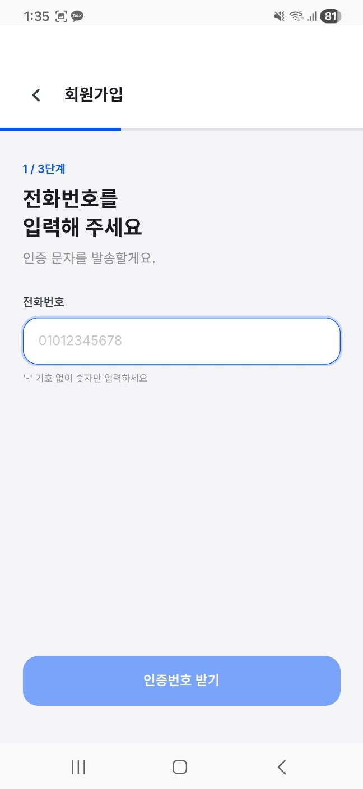 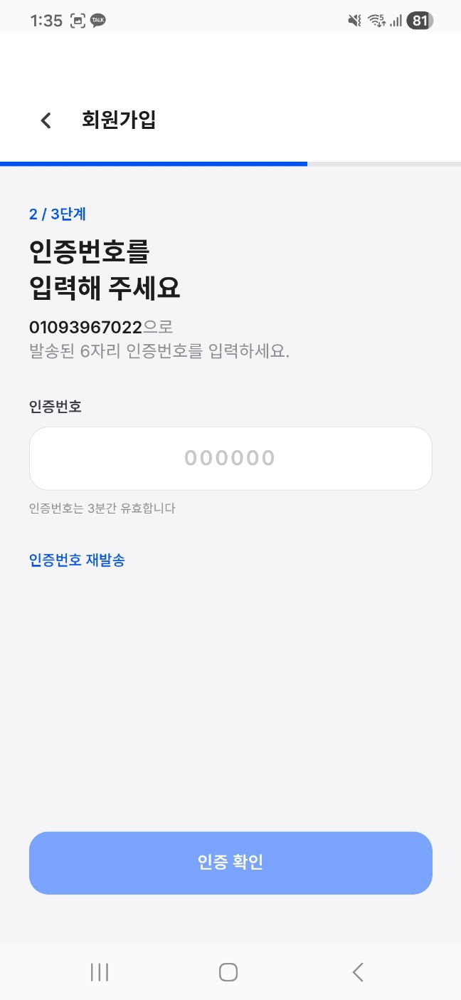 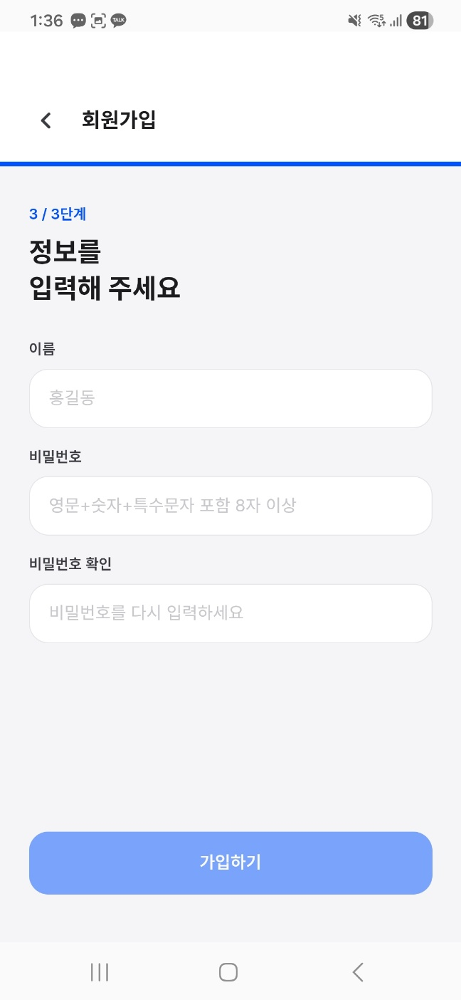

- **라우트**: `/signup` (단일 라우트 내 3단계 전환)
- **개요**: 전화번호 SMS 인증 기반 회원가입. 상단 진행 바가 단계에 따라 1/3씩 채워진다.
- **헤더 뒤로가기(`<`)**: 2·3단계에서는 이전 단계로, 1단계에서는 로그인 화면으로 돌아간다.

**AUTH-02. [1/3단계] 전화번호 입력** (스크린샷 2)

- 타이틀 "전화번호를 입력해 주세요" / 서브 "인증 문자를 발송할게요."
- 전화번호 입력 필드 (가이드: "'-' 기호 없이 숫자만 입력하세요")
- **[인증번호 받기]**: 탭 시 인증 문자 발송 API 호출 → 성공 시 2단계로 전환

**AUTH-03. [2/3단계] 인증번호 입력** (스크린샷 3)

- 입력한 전화번호를 타이틀 영역에 표시하고 "발송된 6자리 인증번호를 입력하세요." 안내
- 인증번호 6자리 입력 필드 (가이드: "인증번호는 3분간 유효합니다")
- **[인증번호 재발송]** 텍스트 링크: 동일 번호로 인증 문자를 다시 발송
- **[인증 확인]**: 6자리 입력 시 검증 API 호출 → 성공 시 가입 토큰(signupToken)을 받고 3단계로 전환

**AUTH-04. [3/3단계] 정보 입력** (스크린샷 4)

- 입력 필드: **이름**, **비밀번호**(가이드: 영문+숫자+특수문자 포함 8자 이상), **비밀번호 확인**
- 비밀번호와 확인 값이 다르면 가입 진행 불가
- **[가입하기]**: 성공 시 자동 로그인되어 온보딩(`/onboarding`)으로 이동

**에러 메시지**

| 서버 에러 코드 | 노출 문구 |
| --- | --- |
| `SMS_SEND_FAILED` | 문자 발송에 실패했습니다. 번호를 확인해 주세요. |
| `INVALID_VERIFICATION_CODE` | 인증번호가 틀리거나 만료되었습니다. |
| `EXPIRED_SIGNUP_TOKEN` | 인증 시간이 만료되었습니다. 다시 시도해 주세요. |
| `PHONE_ALREADY_REGISTERED` | 이미 가입된 전화번호입니다. |

---

## 5. 온보딩 (ONB)

- **라우트**: `/onboarding` (단일 라우트 내 8단계 전환)
- **공통 UI**: 상단에 "N / 8 단계" 텍스트와 진행률(%) 및 진행 바. 하단 고정 영역에 **[다음]**(단계별 활성화 조건 충족 시 파란색) / **[이전]**(2단계부터 노출) 버튼.
- **단계별 즉시 저장**: 1단계(카드)와 2단계(업비트 키)는 [다음] 탭 시점에 서버에 즉시 저장·검증되고, 실패하면 에러 문구와 함께 해당 단계에 머문다. 설문(3~7단계)은 7단계 완료 시 일괄 제출된다.
- **부분 완료 재진입**: 온보딩 도중 이탈한 사용자는 재로그인 시 첫 미완료 단계부터 재개한다. (카드 미등록 → 1단계, 업비트 미연동 → 2단계, 성향 미입력 → 3단계)
- **업비트 키 만료 재연동 모드**: 기존 가입자의 업비트 키만 만료된 경우 2단계로 진입하며, 상단에 빨간 경고 배너("보안을 위해 업비트 권한이 만료되었습니다. 업비트 API 키를 다시 연동해 주세요.")가 표시된다. 재연동 완료 시 나머지 단계를 건너뛰고 바로 홈으로 이동한다.

### ONB-01. [1/8] 케이뱅크 카드 등록 (13%)

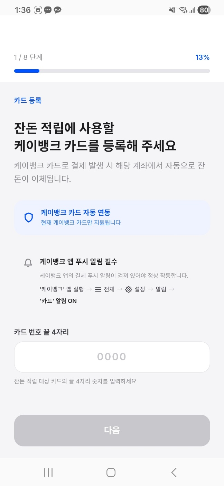

- **개요**: 잔돈 적립의 기준이 되는 케이뱅크 카드를 등록한다. 케이뱅크 카드로 결제가 발생하면 해당 계좌에서 잔돈이 자동 이체된다.

**UI 구성 및 동작**

1. **안내 배너 (파란색)**: "케이뱅크 카드 자동 연동 — 현재 케이뱅크 카드만 지원됩니다"
2. **케이뱅크 앱 푸시 알림 필수 안내**: 결제 수집이 케이뱅크 앱의 결제 푸시 알림 기반이므로 알림이 꺼져 있으면 동작하지 않는다. 설정 경로를 단계별로 안내: `'케이뱅크' 앱 실행 → 전체 → 설정 → 알림 → '카드' 알림 ON`
3. **카드 번호 끝 4자리 입력**: 숫자 4자리(placeholder "0000"). 정확히 4자리 숫자가 입력되어야 [다음] 활성화
4. **[다음]**: 카드 정보를 서버에 저장("저장 중...") 후 2단계로 이동

### ONB-02. [2/8] 업비트 계정 연결 (25%)

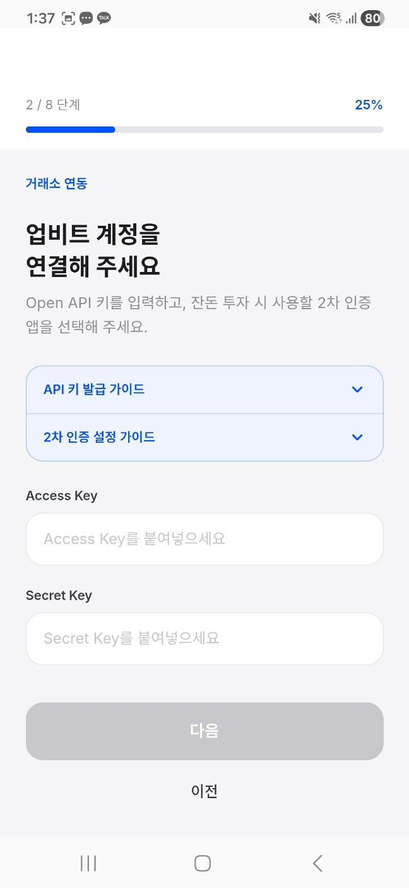 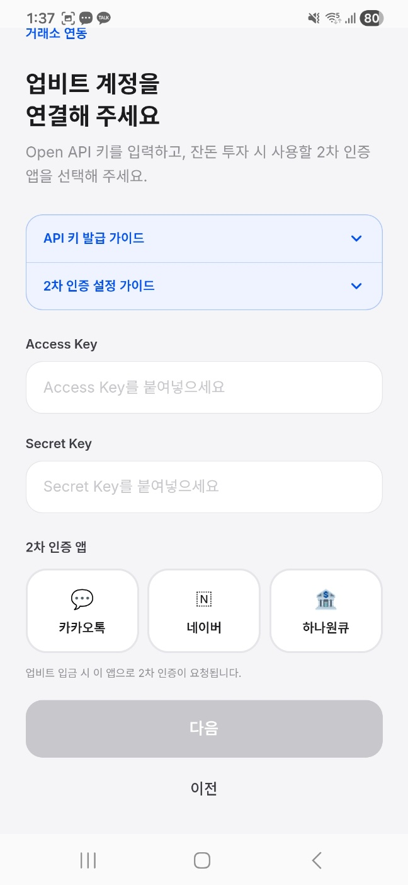

- **개요**: 잔돈 투자를 실행할 업비트 Open API 키를 연동하고, 업비트 입금 시 사용할 2차 인증 앱을 선택한다.

**UI 구성 및 동작**

1. **가이드 아코디언 2종** (탭 시 펼침/접힘)
   - **API 키 발급 가이드**: PC 환경에서 업비트 Open API 페이지 접속 → 권한 체크(자산조회 · 주문조회 · 주문하기 · 입금조회 · 입금하기) → 서버 IP(`34.64.106.45`) 등록 → 키 발급·복사 순서를 단계별로 안내
   - **2차 인증 설정 가이드**: 업비트 앱에서 2채널 인증(카카오톡 · 네이버 · 하나인증서 중 택1)을 활성화하는 경로 안내
2. **Access Key / Secret Key 입력**: placeholder "…를 붙여넣으세요". Secret Key는 마스킹 처리
3. **2차 인증 앱 선택**: `카카오톡` / `네이버` / `하나원큐` 3개 카드 중 단일 선택. 하단 안내 "업비트 입금 시 이 앱으로 2차 인증이 요청됩니다."
4. **[다음]**: 두 키 + 2차 인증 앱이 모두 선택되어야 활성화. 탭 시 서버에서 키 유효성을 실제 검증("검증 중...")하고, 실패 시 에러 문구 노출

### ONB-03 ~ 07. [3~7/8] 투자 성향 설문 Q1~Q5 (38% ~ 88%)

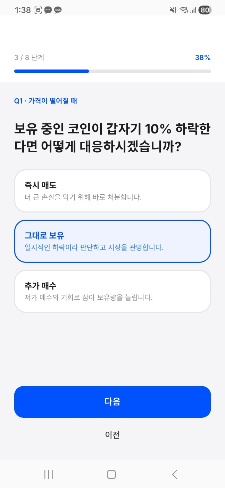 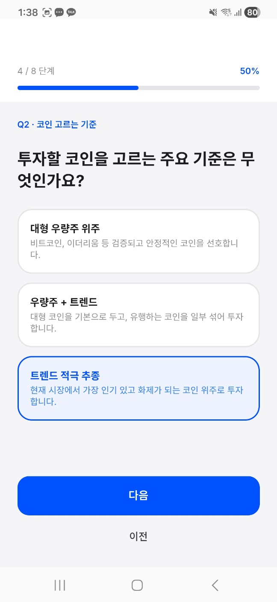 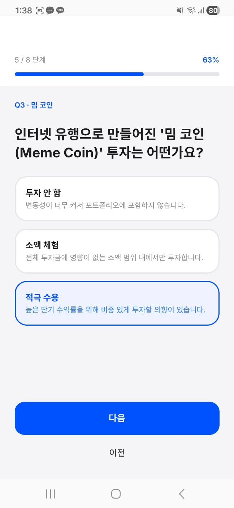 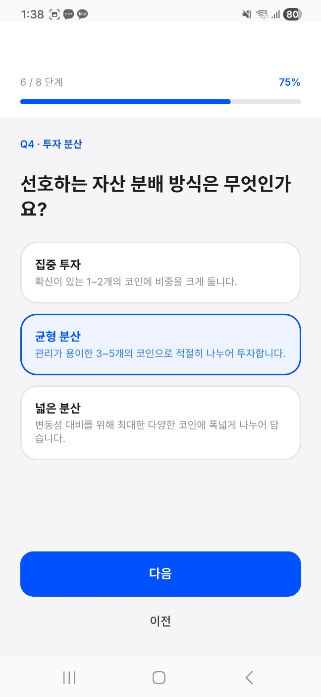 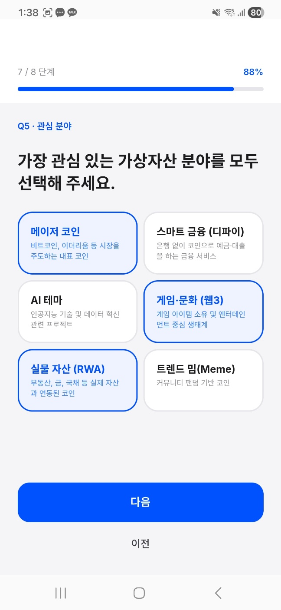

- **개요**: AI 코인 추천에 반영되는 투자 성향을 5문항으로 수집한다. 한 화면당 한 문항(1 Screen 1 Task) 구성.
- **선택지 상태**: 미선택 = 흰 배경 + 회색 테두리 / 선택 = 파란 테두리 + 연한 파란 배경 + 파란 텍스트
- Q1~Q4는 **단일 선택**(기본값이 미리 선택되어 있어 항상 [다음] 진행 가능), Q5는 **다중 선택**(2열 그리드, 1개 이상 선택해야 [다음] 활성화).
- Q5에서 [다음] 탭 시 설문 전체가 서버에 제출된다("저장 중...").

**설문 문항 및 선택지**

| 단계 | 태그 | 질문 | 선택지 (굵게 = 기본값) |
| --- | --- | --- | --- |
| 3/8 | Q1 · 가격이 떨어질 때 | 보유 중인 코인이 갑자기 10% 하락한다면 어떻게 대응하시겠습니까? | 즉시 매도 / **그대로 보유** / 추가 매수 |
| 4/8 | Q2 · 코인 고르는 기준 | 투자할 코인을 고르는 주요 기준은 무엇인가요? | 대형 우량주 위주 / **우량주 + 트렌드** / 트렌드 적극 추종 |
| 5/8 | Q3 · 밈 코인 | 인터넷 유행으로 만들어진 '밈 코인(Meme Coin)' 투자는 어떤가요? | **투자 안 함** / 소액 체험 / 적극 수용 |
| 6/8 | Q4 · 투자 분산 | 선호하는 자산 분배 방식은 무엇인가요? | 집중 투자 / **균형 분산** / 넓은 분산 |
| 7/8 | Q5 · 관심 분야 | 가장 관심 있는 가상자산 분야를 모두 선택해 주세요. | 메이저 코인 · 스마트 금융(디파이) · AI 테마 · 게임·문화(웹3) · 실물 자산(RWA) · 트렌드 밈(Meme) — 다중 선택 |

### ONB-08. [8/8] 잔돈 규칙 설정 (100%)

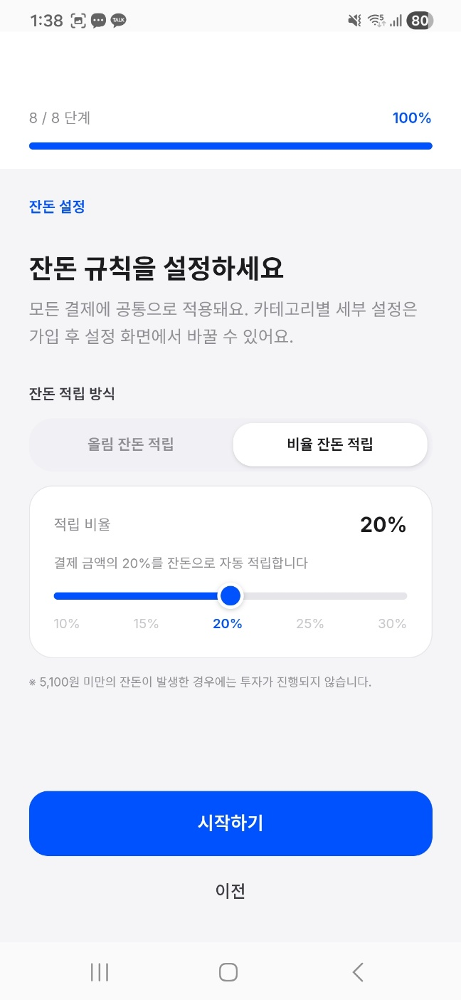

- **개요**: 온보딩 마지막 단계. 결제 시 잔돈을 어떻게 계산할지 규칙을 설정한다. 여기서 정한 규칙은 **모든 카테고리에 공통 적용**되며, 카테고리별 세부 설정은 가입 후 설정 화면(SET-03)에서 변경할 수 있다.

**UI 구성 및 동작**

1. **적립 방식 세그먼트**: `올림 잔돈 적립` / `비율 잔돈 적립` 토글 (선택된 쪽이 흰색 배경으로 강조)
2. **설정 카드 (슬라이더)**: 선택된 방식에 따라 5구간 슬라이더로 값을 조절하며, 상단 값 라벨과 설명 문구가 실시간 동기화된다.
   - **올림**: 1만 / 2만 / 3만 / 4만 / 5만 원 단위 — "결제 후 N원 단위로 올림한 잔돈을 적립합니다"
   - **비율**: 10 / 15 / 20 / 25 / 30 % — "결제 금액의 N%를 잔돈으로 자동 적립합니다"
3. **정책 고지**: "※ 5,100원 미만의 잔돈이 발생한 경우에는 투자가 진행되지 않습니다."
4. **[시작하기]**: 선택한 규칙을 7개 전체 카테고리에 일괄 적용 저장 → 온보딩 완료 처리 → 홈으로 이동

---

## 6. 홈 (HOME)

### HOME-01. 홈 — 내 보유자산

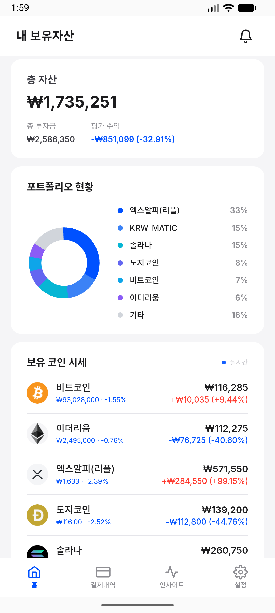

> ⚠️ 위 스크린샷(14.png)은 구버전 캡처입니다. 현재 버전에는 우측 상단 알림(종) 아이콘이 없고, 보유 목록 최상단에 '원화(보유 현금)' 행이 고정 표시됩니다. 아래 설명은 현재 코드 기준입니다. 스크린샷 교체가 필요합니다.

- **라우트**: `/` (하단 탭: 홈)
- **개요**: 온보딩 완료 후 진입하는 메인 대시보드. 총 자산, 포트폴리오 비중, 보유 코인별 실시간 시세·손익을 한눈에 보여준다.
- **실시간 시세**: 화면 진입 시 보유 코인의 마켓 코드로만 업비트 웹소켓 시세를 구독하고, 화면 이탈 시 연결을 해제한다. 실시간 시세가 아직 도착하지 않은 코인은 매입 단가 기준 스냅샷 값으로 표시한다.

**UI 구성 및 동작**

1. **헤더**: 타이틀 "내 보유자산" (상단 고정)
2. **총 자산 카드**
   - **총 자산**: 원화 잔액 + 보유 코인 실시간 평가금 합계 (₩, 천 단위 콤마, 최대 강조)
   - **총 투자금**: 매수 원금 합계
   - **평가 수익**: `±₩금액 (±수익률%)` 형식. 수익 빨강 / 손실 파랑 / 0 회색
3. **포트폴리오 현황 카드 (도넛 차트 + 범례)**
   - 원화(현금)를 제외한 **코인 평가금액 비중**을 실시간으로 시각화
   - 평가금액 상위 코인부터 누적 비중 80%까지 개별 색상으로 표시하고, 나머지는 회색 '기타'로 묶는다 (남은 코인이 1개뿐이면 묶지 않고 그대로 표시)
   - 보유 코인이 없으면 빈 링과 "아직 보유한 코인이 없어요." 문구 노출
4. **보유 코인 시세 카드**
   - 우측 상단 연결 상태 인디케이터: 웹소켓 연결 시 파란 점(깜빡임) + "실시간" / 연결 전 "연결 중..." / 보유 코인이 없으면 "보유 코인 없음"
   - **원화(보유 현금) 행**: 항상 목록 최상단 고정. `₩` 아이콘 + 잔액만 표시(시세·손익 없음)
   - **코인 행 (좌측)**: 코인 아이콘, 코인명, 현재가 · 전일 대비 등락률(상승 빨강/하락 파랑)
   - **코인 행 (우측)**: 내 평가 금액, 평가손익 `±₩금액 (±%)`
5. **하단 탭 바**: [홈] 활성

---

## 7. 결제 내역 & 잔돈 투자 (PAY)

### PAY-01. 결제 내역

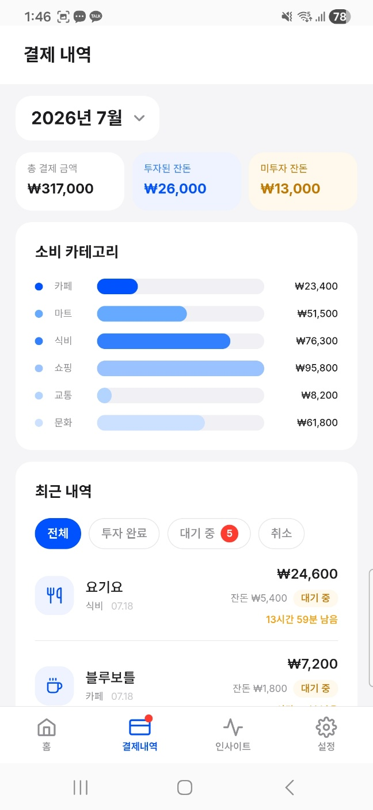 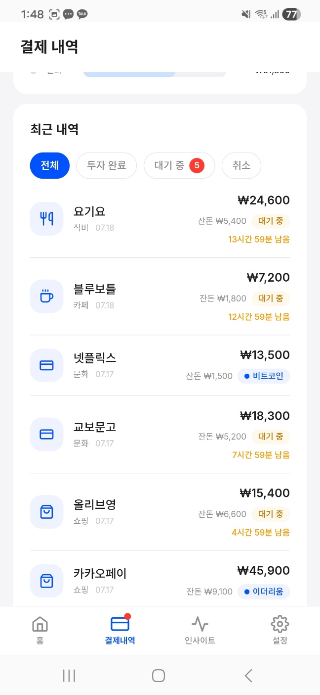

- **라우트**: `/payments` (하단 탭: 결제내역)
- **개요**: 케이뱅크 카드 결제 내역과 각 결제에서 발생한 잔돈의 투자 상태를 월 단위로 조회·관리한다. 화면의 모든 수치는 선택된 월 기준이다.

**UI 구성 및 동작**

1. **월 선택 버튼**: `YYYY년 M월 ∨` — 탭 시 조회 기간 선택 바텀시트(PAY-02) 노출. 월 변경 시 요약·차트·내역이 모두 갱신된다.
2. **월간 요약 카드 3종**
   - **총 결제 금액** (흰색 카드): 해당 월 누적 카드 결제액
   - **투자된 잔돈** (파란색 강조): 실제 코인 매수까지 완료된 잔돈 합계
   - **미투자 잔돈** (노란색 강조): 발생했지만 투자되지 않은 잔돈 합계
3. **소비 카테고리 막대그래프**: 카테고리(카페/마트/식비/쇼핑/교통/문화/기타)별 지출액을 가로 막대로 표시. 최대 지출 카테고리를 기준으로 상대 길이가 결정되며, '기타'는 항상 마지막에 배치. 내역이 없으면 "이번 달 소비 내역이 없어요."
4. **최근 내역 리스트**
   - **상태 필터 칩**: `전체` / `투자 완료` / `대기 중` / `취소` — 서버 사이드 필터로, 선택 시 목록을 다시 불러온다. `대기 중` 칩에는 대기 건수 뱃지가 붙는다 (10건 이상이면 "9+", 빨간 배경 · 칩 활성 시 흰 배경)
   - **리스트 아이템 구성**
     - 좌측: 카테고리 아이콘 — **탭하면 카테고리 변경 바텀시트(PAY-03) 노출**
     - 중앙: 결제처명, 카테고리 · 결제일(MM.DD)
     - 우측: 결제 금액, 잔돈 금액 + 상태 표시
   - **상태별 우측 표시**

     | 상태 | 표시 |
     | --- | --- |
     | 투자 완료 (INVESTED) | 파란 코인 칩 `● 코인명` + 아래 줄에 `수량개 · ₩체결단가` |
     | 대기 중 (PENDING) | 노란 `대기 중` 뱃지 + **승인 마감까지 남은 시간 카운트다운** (예: "13시간 59분 남음") |
     | 투자 취소 (CANCELED) | `투자 취소` 뱃지 |
     | 만료 (EXPIRED) | `만료` 뱃지 |

   - **대기 중 행 탭** → 해당 건의 정보를 가지고 잔돈 투자 확인 화면(PAY-04)으로 이동 (다른 상태의 행은 탭 동작 없음)
   - **무한 스크롤**: 목록 하단 도달 시 다음 페이지 자동 로드 ("불러오는 중…")
5. **하단 탭 바**: [결제내역] 활성. 대기 건 존재 시 탭 아이콘에 빨간 점

### PAY-02. [시트] 조회 기간 선택 — 스크린샷 없음

- 월 선택 버튼 탭 시 노출되는 바텀시트. 최근 **12개월**이 최신순으로 나열되고, 현재 선택된 월은 파란 배경 + 체크 아이콘으로 표시된다. 항목 탭 시 시트가 닫히며 해당 월 데이터로 갱신.

### PAY-03. [시트] 결제 카테고리 변경 — 스크린샷 없음

- 결제 내역 아이템의 카테고리 아이콘 탭 시 노출. 7개 카테고리(카페/식비/마트/쇼핑/교통/문화/기타)가 아이콘 + 라벨의 4열 그리드로 나열되고, 현재 카테고리는 파란색으로 강조된다.
- 다른 카테고리 선택 시 서버에 즉시 저장("저장 중…") 후 시트가 닫히고 목록에 반영된다. 같은 카테고리를 선택하면 저장 없이 닫힌다.

### PAY-04. 잔돈 투자 확인 (수동 승인)

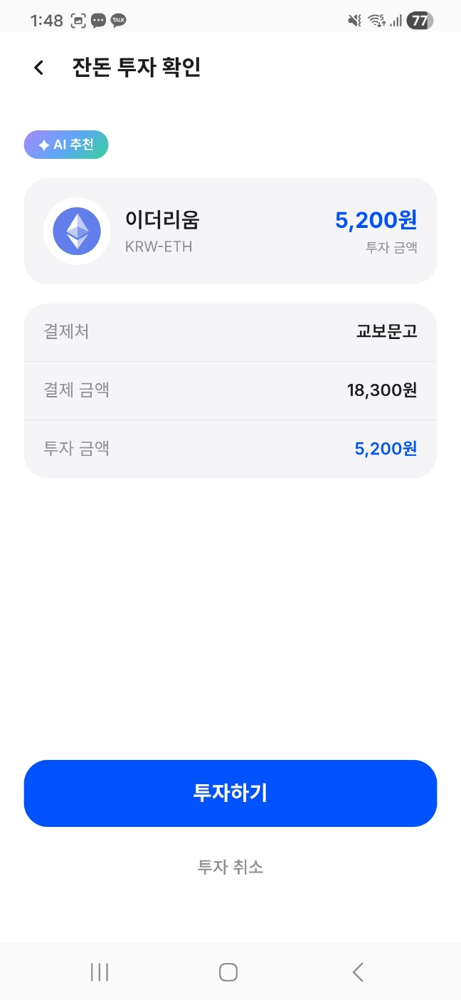

- **라우트**: `/payments/review` (쿼리 파라미터: eventId, merchant, amount, spareChange, ticker, stockName)
- **진입 경로**: ① 결제 내역의 '대기 중' 건 탭, ② 투자 제안 푸시 알림 탭(딥링크 `tikkle://payments/review?...`)
- **개요**: 대기 중인 잔돈 투자 제안을 승인하거나 취소하는 화면. AI가 투자 성향 기반으로 추천한 코인이 함께 표시된다.
- **뒤로가기**: 딥링크 진입 시 히스토리가 없으므로 항상 결제 내역(`/payments`)으로 이동.

**UI 구성 및 동작**

1. **`✦ AI 추천` 뱃지**: 보라→파랑→초록 그라데이션 배경으로 시각적 강조
2. **추천 코인 카드**: 코인 아이콘, 코인명(예: 이더리움), 마켓 코드(예: KRW-ETH), 우측에 투자 금액(파란색 강조)
3. **결제 상세 표**: 결제처 / 결제 금액 / 투자 금액(파란색) 3행
4. **[투자하기]** (Primary): 탭 시 승인 API 호출 후 실시간 결과 스트림(SSE)을 구독하며 **PAY-05 (2차 인증 대기)** 상태로 전환
5. **[투자 취소]** (텍스트 버튼): 탭 시 거절 API 호출("취소 중...") → 결제 내역으로 복귀, 해당 건은 '투자 취소' 상태가 됨
6. **예외**: 주문 정보(eventId)가 없으면 "잘못된 접근이에요." 문구와 함께 버튼 비활성화. 승인 시점에 업비트 키가 만료된 경우 즉시 '업비트 인증 만료' 화면(PAY-07)으로 전환

### PAY-05. 2차 인증 대기

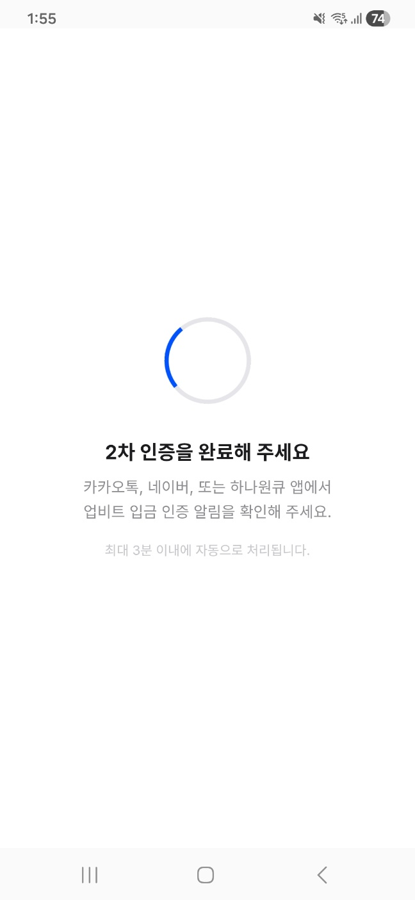

- **개요**: 투자 승인 직후, 업비트 입금에 필요한 2차 인증을 기다리는 로딩 화면. 서버와 SSE로 연결되어 결과 이벤트를 대기한다.
- 대형 스피너 + "2차 인증을 완료해 주세요" + "카카오톡, 네이버, 또는 하나원큐 앱에서 업비트 입금 인증 알림을 확인해 주세요." + "최대 3분 이내에 자동으로 처리됩니다."
- 결과 이벤트 수신 시 아래 PAY-06 또는 PAY-07의 결과 화면으로 자동 전환된다.

### PAY-06. 매수 완료

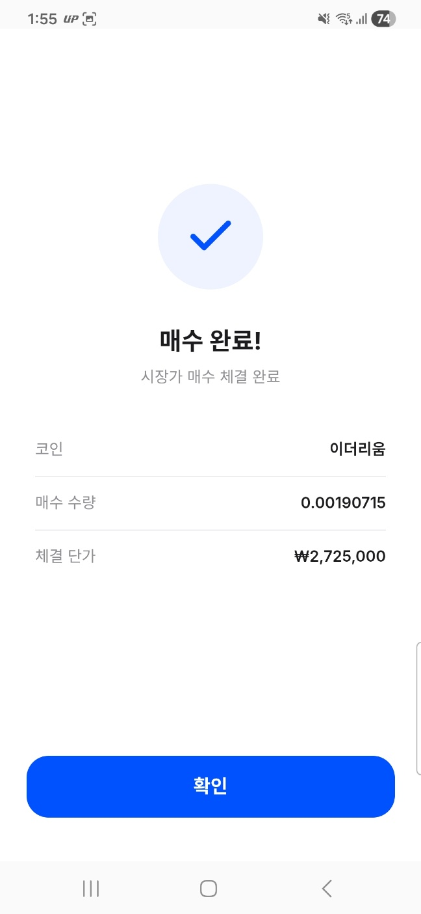

- **개요**: 시장가 매수 체결이 완료된 성공 화면.
- 체크 아이콘 + "매수 완료!" + 체결 상세 표(코인 / 매수 수량 / 체결 단가)
- **[확인]** → 결제 내역으로 이동 (해당 건은 '투자 완료' 상태로 표시)

### PAY-07. 투자 결과 분기 화면 (5종) — 스크린샷 없음

2차 인증 대기 중 수신한 결과 이벤트에 따라 아래 화면 중 하나로 전환된다. 실패 계열은 해당 결제 건이 '투자 취소' 상태로 처리된다.

| 결과 | 화면 타이틀 | 주요 내용 및 액션 |
| --- | --- | --- |
| 체결 지연 | **주문 접수 완료** (시계 아이콘) | 주문은 접수됐으나 체결 대기 중. "체결이 완료되면 푸시 알림으로 안내" 안내 박스. [확인] → 결제 내역 |
| 입금 실패 | **입금 실패** (X 아이콘) | 업비트 입금이 거절·취소됨. [돌아가기] → 결제 내역 |
| 매수 실패 | **매수 실패** (X 아이콘) | 입금은 됐으나 매수 주문 실패. **"출금된 원화는 업비트 계좌에 안전하게 보관되어 있습니다"** 고지 필수 표시. [돌아가기] |
| 인증 시간 초과 | **인증 시간 초과** (시계 아이콘) | 2차 인증 3분 초과. [돌아가기] |
| 업비트 키 만료 | **업비트 인증 만료** (X 아이콘) | [업비트 재연동] → 업비트 계정 관리(SET-07) / [나중에 하기] → 결제 내역 |

---

## 8. 인사이트 (INS)

- **라우트**: `/insights` (하단 탭: 인사이트)
- **상단 탭**: `오늘의 마켓 토픽` / `초보자 가이드` — 탭 전환 시 하단에 파란 밑줄 인디케이터. 두 탭의 데이터는 진입 시 미리 함께 로드되어 전환이 즉시 이루어진다.

### INS-01. 오늘의 마켓 토픽

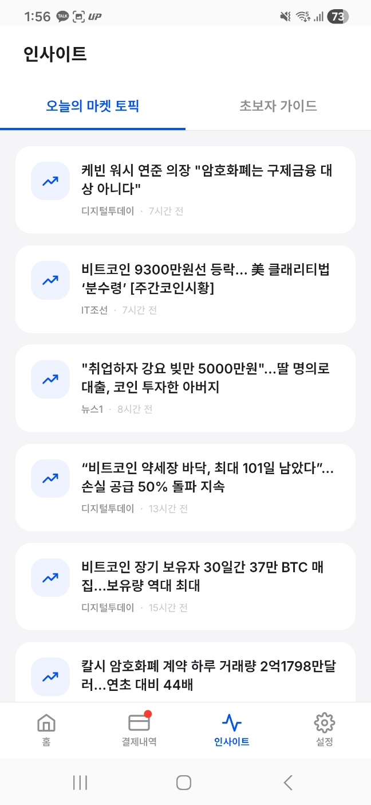

- **개요**: 가상자산 관련 최신 뉴스를 큐레이션해 보여주는 탭.
- **뉴스 카드**: 썸네일 이미지(제공 시) 또는 상승 차트 아이콘(폴백), 기사 제목, `매체명 · 상대 시간`(예: "디지털투데이 · 7시간 전" — 분/시간/일 단위 자동 표기)
- **카드 탭** → 기사 원문을 외부(시스템) 브라우저로 연다.
- 데이터가 없으면 "표시할 마켓 토픽이 없습니다" 빈 상태 노출.

### INS-02. 초보자 가이드

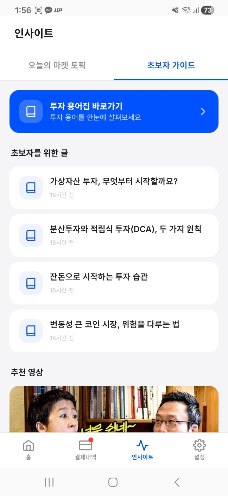

- **개요**: 초보 투자자를 위한 용어집·가이드 글·추천 영상을 모은 탭.

**UI 구성 및 동작**

1. **투자 용어집 배너** (파란 배경): "투자 용어집 바로가기 — 투자 용어를 한눈에 살펴보세요" → 탭 시 INS-04로 이동
2. **초보자를 위한 글**: 책 아이콘 + 제목 + 상대 시간 리스트. 탭 시 글 상세 바텀시트(INS-03) 노출
3. **추천 영상**: 16:9 썸네일 + 재생 버튼 오버레이 + 제목 + 채널명. 탭 시 외부 브라우저(유튜브)로 연결

### INS-03. [시트] 초보자 글 상세 — 스크린샷 없음

- 화면 높이 약 90%의 바텀시트. 상단 드래그 핸들 + 우측 `X` 닫기 버튼.
- 열릴 때 글 본문을 서버에서 새로 조회(로딩 스피너)하며, 제목 + (선택) 헤더 이미지 + 본문(줄바꿈 유지)을 시트 내부 스크롤로 읽을 수 있다.

### INS-04. 투자 용어집

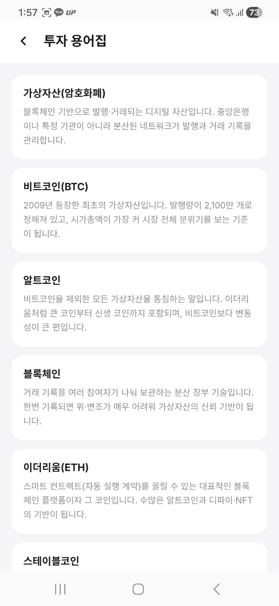

- **라우트**: `/insights/glossary`
- **개요**: 가상자산 기초 용어를 카드 리스트로 풀이한 사전 화면. 헤더 뒤로가기(`<`)로 인사이트 탭에 복귀.
- **용어 카드**: 용어명(굵게, 예: "비트코인(BTC)") + 초보자 눈높이 설명. 수록 용어 예: 가상자산(암호화폐), 비트코인, 알트코인, 블록체인, 이더리움, 스테이블코인 등.
- 목록은 서버에서 조회하며 한 번 불러온 뒤 캐시된다. 데이터가 없으면 "등록된 투자 용어가 없습니다" 노출.

---

## 9. 설정 (SET)

### SET-01. 설정 메인

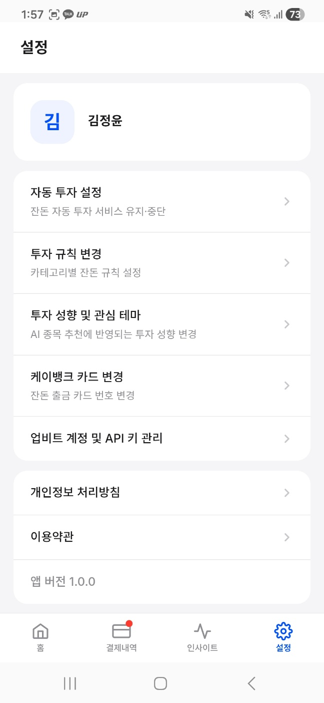 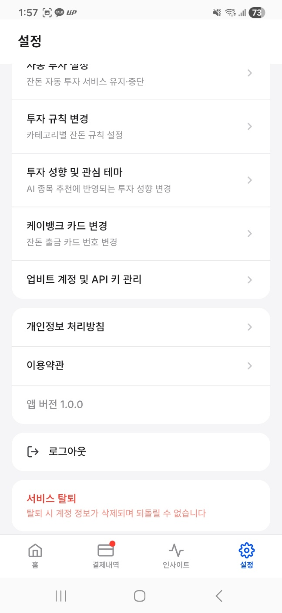

- **라우트**: `/settings` (하단 탭: 설정)
- **개요**: 계정 정보 확인과 서비스 핵심 설정(온보딩 때 등록한 항목 포함)의 진입점.

**UI 구성 및 동작**

1. **프로필 카드**: 이름 첫 글자 아바타(파란 배경) + 이름 + 이메일(있는 경우)
2. **투자 설정 메뉴 그룹**

   | 메뉴 | 서브 텍스트 | 이동 |
   | --- | --- | --- |
   | 자동 투자 설정 | 잔돈 자동 투자 서비스 유지·중단 | SET-02 |
   | 투자 규칙 변경 | 카테고리별 잔돈 규칙 설정 | SET-03 |
   | 투자 성향 및 관심 테마 | AI 종목 추천에 반영되는 투자 성향 변경 | SET-05 |
   | 케이뱅크 카드 변경 | 잔돈 출금 카드 번호 변경 | SET-06 |
   | 업비트 계정 및 API 키 관리 | — | SET-07 |

3. **일반 메뉴 그룹**: `개인정보 처리방침`, `이용약관`(각각 바텀시트로 열람, SET-08), `앱 버전 1.0.0`(탭 불가 표시 전용)
4. **[로그아웃]**: 탭 시 즉시 로그아웃 처리("로그아웃 중..." + 스피너) → 세션 삭제 후 로그인 화면으로 이동
5. **[서비스 탈퇴]** (빨간 텍스트): 서브 텍스트 "탈퇴 시 계정 정보가 삭제되며 되돌릴 수 없습니다". 탭 시 탈퇴 확인 바텀시트(SET-09) 노출
6. **문의**: 하단에 문의 메일 주소 링크 (탭 시 메일 앱 연결)

### SET-02. 자동 투자 설정

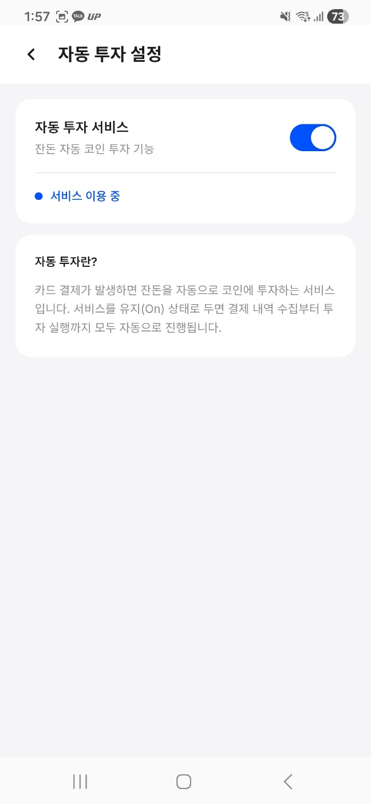

- **라우트**: `/settings/investment`
- **개요**: 잔돈 자동 투자 서비스 전체를 켜고 끄는 화면.

**UI 구성 및 동작**

1. **토글 카드**: "자동 투자 서비스 — 잔돈 자동 코인 투자 기능" + 토글 스위치. 하단에 현재 상태 라벨(`● 서비스 이용 중` 파란색 / `서비스 중단 중` 회색)
2. **끌 때 (On → Off)**: 즉시 꺼지지 않고 **중단 확인 바텀시트**가 먼저 노출된다.
   - 경고 내용: "서비스를 중단할 경우, 티끌 앱 내에 결제 내역(영수증) 자체가 아예 저장되지 않습니다."
   - [서비스 중단](빨간색) 탭 시에만 실제 중단 / [취소] 시 유지
3. **켤 때 (Off → On)**: 확인 없이 즉시 저장
4. **중단 상태**: 토글 카드 아래에 동일한 경고 문구의 빨간 안내 박스가 상시 노출
5. **설명 카드**: "자동 투자란?" — 결제 발생 시 잔돈을 자동으로 코인에 투자하며, On 상태면 결제 내역 수집부터 투자 실행까지 전 과정이 자동으로 진행된다는 설명

### SET-03. 잔돈 규칙 설정 (카테고리별)

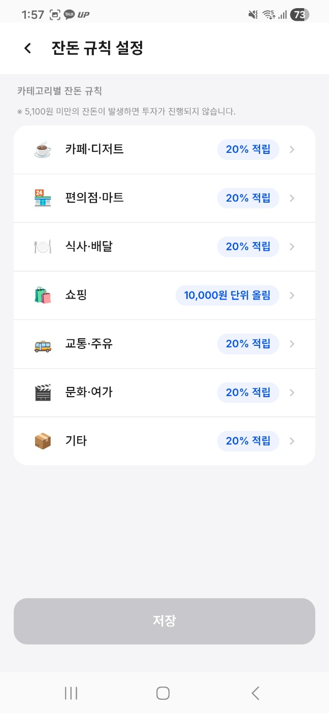

- **라우트**: `/settings/category-rules`
- **개요**: 온보딩에서 일괄 적용한 잔돈 규칙을 **카테고리별로 다르게** 커스텀하는 화면.

**UI 구성 및 동작**

1. **정책 고지**: "※ 5,100원 미만의 잔돈이 발생하면 투자가 진행되지 않습니다."
2. **카테고리 리스트 (7종)**: 이모지 아이콘 + 카테고리명 + 현재 규칙 뱃지 + `>` 화살표
   - 카테고리: ☕ 카페·디저트 / 🏪 편의점·마트 / 🍽️ 식사·배달 / 🛍️ 쇼핑 / 🚌 교통·주유 / 🎬 문화·여가 / 📦 기타
   - 규칙 뱃지 표기 예: `20% 적립`, `10,000원 단위 올림`
   - **미저장 변경이 있는 카테고리는 뱃지가 파란 배경(흰 글자)으로 강조**되어 저장 전 상태를 구분할 수 있다
3. **행 탭** → 해당 카테고리의 규칙 편집 바텀시트(SET-04) 노출
4. **[저장]** (하단 고정): 서버 값과 달라진 카테고리가 하나라도 있어야 활성화. 탭 시 7개 카테고리 규칙을 일괄 저장("저장 중...")

### SET-04. [시트] 카테고리 잔돈 규칙 편집 — 스크린샷 없음

- 헤더에 선택한 카테고리(`🚌 교통·주유 잔돈 규칙` 형식) 표시.
- 온보딩 8단계와 동일한 **규칙 편집기**(올림/비율 세그먼트 + 5구간 슬라이더 + 5,100원 정책 고지)를 재사용한다.
- 시트에서 조절한 값은 닫는 즉시 목록 뱃지에 반영되며, 실제 서버 저장은 SET-03의 [저장] 버튼에서 일괄 수행된다.

### SET-05. 투자 성향 및 관심 테마 — 스크린샷 없음

- **라우트**: `/settings/investment-profile`
- **개요**: 온보딩 설문(Q1~Q5)을 다시 설정하는 화면. "AI가 잔돈 투자 종목을 추천할 때 아래 성향을 반영합니다. 언제든지 바꿀 수 있어요."
- 온보딩과 동일한 5개 문항이 **한 페이지에 세로로 나열**되며, 진입 시 서버에 저장된 기존 선택값이 미리 선택되어 있다.
- **[저장하기]** (하단 고정): 관심 테마를 1개도 선택하지 않으면 "관심 테마를 하나 이상 선택해 주세요." 에러. 성공 시 "투자 성향이 업데이트되었습니다." 문구 노출.

### SET-06. 케이뱅크 카드 관리 — 스크린샷 없음

- **라우트**: `/settings/kbank-card`
- **개요**: 잔돈이 출금될 케이뱅크 카드를 변경하는 화면.

**UI 구성 및 동작**

1. **현재 등록된 카드**: `•••• 1234` 형식으로 마스킹 표시 (조회 실패 시 에러 문구)
2. **카드 번호 확인 안내 배너**: "케이뱅크 앱 → 카드 → 카드 정보에서 카드 번호를 확인할 수 있어요."
3. **푸시 알림 필수 안내**: 온보딩 1단계와 동일한 케이뱅크 앱 알림 설정 경로 안내
4. **카드 번호 끝 4자리 입력** + **[저장하기]**: 숫자 4자리 검증 후 저장. 성공 시 "케이뱅크 카드가 업데이트되었습니다." 노출 및 입력 필드 초기화

### SET-07. 업비트 계정 관리 — 스크린샷 없음

- **라우트**: `/settings/api-key`
- **개요**: 업비트 Open API 키와 2차 인증 수단을 재등록하는 화면. 키 만료 시(홈/투자 플로우에서 안내됨) 재연동 진입점이기도 하다.

**UI 구성 및 동작**

1. **타이틀**: "업비트 계정을 변경해 주세요" — 새 키 입력 시 즉시 업데이트됨을 안내
2. **가이드 아코디언**: 온보딩 2단계와 동일한 'API 키 발급 가이드'(권한 5종 체크, 서버 IP 등록 등) / '2차 인증 설정 가이드'
3. **입력 폼**: Access Key / Secret Key(마스킹) / 2차 인증 수단(카카오톡·네이버·하나원큐 중 택1)
4. **[저장하기]**: 세 항목 모두 입력해야 하며("모든 항목을 입력해 주세요."), 성공 시 "업비트 계정 정보가 업데이트되었습니다." 노출 후 보안을 위해 Secret Key 입력값은 비워진다

### SET-08. [시트] 개인정보 처리방침 / 이용약관 — 스크린샷 없음

- 설정 메인에서 각 메뉴 탭 시 화면 높이 85%의 바텀시트로 열린다. 헤더에 문서명 + `X` 닫기, 본문은 시트 내부 스크롤.
- 현재는 "내용이 곧 추가될 예정입니다." 플레이스홀더가 표시된다. **(TODO: 약관 본문 채워 넣기)**

### SET-09. [시트] 서비스 탈퇴 확인 — 스크린샷 없음

- 설정 메인의 [서비스 탈퇴] 탭 시 노출되는 확인 바텀시트.
- **경고 박스**: "⚠️ 주의 — 탈퇴 시 계정 정보가 삭제됩니다. 이 작업은 되돌릴 수 없습니다."
- **[탈퇴 신청하기]** (빨간색): 계정 삭제 API 호출("처리 중...") → 성공 시 세션 정리 후 로그인 화면으로 이동. 실패 시 시트가 유지되어 재시도 가능
- **[취소]**: 시트 닫기

---

## 10. 부록 — 데이터 정의 및 정책 요약

### 10.1 잔돈 규칙 (RuleType)

| 방식 | 옵션 | 계산 방법 |
| --- | --- | --- |
| 올림 적립 | 1만 / 2만 / 3만 / 4만 / 5만 원 | 결제 금액을 해당 단위로 올림한 차액을 잔돈으로 적립 |
| 비율 적립 | 10 / 15 / 20 / 25 / 30 % | 결제 금액의 해당 비율을 잔돈으로 적립 |

- 온보딩(ONB-08)에서는 전 카테고리 공통으로 1개 규칙을 적용하고, 설정(SET-03)에서 카테고리별로 개별 변경할 수 있다.
- **최소 투자 금액 정책**: 산출된 잔돈이 **5,100원 미만**이면 해당 결제 건은 투자가 진행되지 않는다.

### 10.2 결제 카테고리 (CategoryType, 7종)

| 코드 | 설정 화면 표기 | 결제 내역 차트 표기 |
| --- | --- | --- |
| CAFE | 카페·디저트 | 카페 |
| MART | 편의점·마트 | 마트 |
| FOOD | 식사·배달 | 식비 |
| SHOPPING | 쇼핑 | 쇼핑 |
| TRAFFIC | 교통·주유 | 교통 |
| CULTURE | 문화·여가 | 문화 |
| ETC | 기타 | 기타 |

### 10.3 결제 건 상태 (TransactionStatus)

| 코드 | 표기 | 의미 |
| --- | --- | --- |
| INVESTED | 투자 완료 | 잔돈으로 코인 매수 체결 완료 (코인명·수량·체결단가 표시) |
| PENDING | 대기 중 | 수동 승인 대기. 마감 시각까지 남은 시간 카운트다운 표시 |
| CANCELED | 투자 취소 | 사용자가 취소했거나 입금/매수 실패·인증 초과로 취소 처리됨 |
| EXPIRED | 만료 | 승인 마감 시간까지 사용자가 결정하지 않아 만료됨 |

### 10.4 투자 성향 프로필

- 항목: 하락 대응(Q1) / 코인 선택 기준(Q2) / 밈 코인 수용도(Q3) / 분산 성향(Q4) / 관심 테마(Q5, 복수)
- 온보딩에서 최초 수집하며 설정(SET-05)에서 언제든 변경 가능. AI 코인 추천에 반영된다.

### 10.5 외부 연동 요약

| 연동 | 용도 | 사용자 준비 사항 |
| --- | --- | --- |
| 케이뱅크 카드 | 결제 감지(푸시 알림 기반) 및 잔돈 출금 | 케이뱅크 앱 '카드' 푸시 알림 ON, 카드 끝 4자리 등록 |
| 업비트 Open API | 잔돈 입금 및 코인 시장가 매수, 자산 조회 | PC에서 API 키 발급(권한: 자산조회·주문조회·주문하기·입금조회·입금하기), 서버 IP `34.64.106.45` 등록 |
| 업비트 2차 인증 | 입금 시 2차 인증 승인 | 카카오톡 / 네이버 / 하나원큐 중 택1, 업비트 앱에서 2채널 인증 활성화 |
| 업비트 웹소켓 | 홈 화면 실시간 시세 | — (자동) |

### 10.6 시간 관련 정책

| 항목 | 값 |
| --- | --- |
| SMS 인증번호 유효 시간 | 3분 |
| 업비트 입금 2차 인증 대기 | 최대 3분 (초과 시 인증 시간 초과 처리) |
| 수동 승인 대기 기한 | 서버가 내려주는 마감 시각(expiredAt)까지 — 결제 내역에 남은 시간 표시, 경과 시 '만료' |

---

### 문서 관리 메모

- [ ] 홈 화면 스크린샷(`14.png`)이 구버전(iOS 캡처, 알림 아이콘 포함)이므로 최신 안드로이드 캡처로 교체 필요
- [ ] 스크린샷 없는 화면(SET-04~09, PAY-02·03·07, INS-03) 캡처는 추후 필요 시 추가
- [ ] 개인정보 처리방침 / 이용약관 본문 확정 시 SET-08 설명 업데이트
